# 🌐 Système de Recommandation de Films - Projet Final

**Auteur : Joye Badou**  
**Produit Final Fonctionnel**

---

##  Sommaire

- [Introduction](#introduction)
- [I. Phase de Collecte des Données](#i-phase-de-collecte-des-données)
- a. Chargement des fichiers (`ratings.csv`, `movies.csv`, etc.)
- b. Vérification de la structure des fichiers
  - Description des données `movie.csv`
  - Description des données `rating.csv`
- c. Centralisation des données dans un système structuré (HDFS)
- [II. Phase de Fiabilisation et Normalisation](#ii-phase-de-fiabilisation-et-normalisation)
- Nettoyage `rating.csv`
- Nettoyage `movie.csv`
- Fusion des données
- [III. Phase d’Analyse Exploratoire](#iii-phase-danalyse-exploratoire)
1. Analyse des Films  
2. Analyse des Notes  
3. Analyse des Genres  
4. Analyse des Utilisateurs
- [IV & V. Phase de Modélisation et d’Évaluation](#iv--v-phase-de-modélisation-et-dévaluation)
- a. Préparation des données pour la matrice utilisateur-item
- b. Implémentation de KNN pour le filtrage collaboratif
  - Modèle User-User : Création
  - Modèle User-User : Évaluation
  - Modèle Item-Item : Création
  - Modèle Item-Item : Évaluation
- c. Développement d’un modèle basé sur le contenu (genres)
  - Modèle basé sur le contenu : Création
  - Modèle basé sur le contenu : Évaluation
- d. Création d’un modèle hybride combinant les deux approches
  - Modèle Hybrid Content-User : Création
  - Modèle Hybrid Content-User : Évaluation
  - Modèle Hybrid Content-Item : Création
  - Modèle Hybrid Content-Item : Évaluation
- e. Optimisation des hyperparamètres pour améliorer les performances
  - Modèle Item-Item KNN : Optimisation
  - Modèle Hybrid Content-Item KNN : Optimisation
- [VI. Produit Final Fonctionnel et Déploiement](#vi-produit-final-fonctionnel-et-déploiement)
1. Script Python interactif permettant à un utilisateur d’entrer son userId et de recevoir des recommandations
2. API RESTful
3. Guide d'utilisation du système de recommandation de films
4. Lien GitHub
- [Conclusion](#conclusion)

---

## Introduction

Mon projet portera sur l’analyse et la modélisation des données du jeu de données MovieLens, une collection comprenant plus de 100000 notations et 943 utilisateurs et environ 1682 films. Malgré l'ambition initiale de travailler sur le dataset MovieLens contenant 33 millions de notations, nous avons opté pour le dataset de 100 000 notations (disponible sur Kaggle à l'adresse ce lien) pour plusieurs raisons.

Tout d'abord, le dataset complet de 33 millions de notations nécessite des ressources matérielles (mémoire vive, temps de calcul) considérablement supérieures, ce qui complique la manipulation et le traitement des données, surtout dans un environnement de développement standard. Ensuite, le dataset 100 k offre un compromis optimal, il est suffisamment riche pour capturer des tendances et générer des recommandations fiables, tout en restant maniable et permettant une itération rapide des modèles et analyses.

Par ailleurs, bien que l'étude des tags ait été envisagée, elle a été finalement écartée pour cette version du projet en raison de la complexité supplémentaire qu'elle imposerait au processus de modélisation. En se concentrant sur les fichiers movies et ratings, nous avons pu bâtir un système de recommandation solide et efficace, qui répond aux objectifs du projet sans surcharge de complexité ni de contraintes matérielles.

---

## I. Phase de Collecte des Données

### a. Chargement des fichiers (`ratings.csv`, `movies.csv`, etc.)

Les fichiers sources ont été téléchargés à partir de Kaggle à l'adresse *ce lien*. C’est un fichier `.zip` qui contient plusieurs données. Nous nous intéresserons uniquement à `u.data` (renommé et converti en `rating.csv`) et à `u.item` (renommé et converti en `movie.csv`).

Voici les chemins des fichiers utilisés :
- `C:\Users\joyeb\Downloads\archive (4).zip`
- `C:\projet_work\Data-source\movie.csv`
- `C:\projet_work\Data-source\rating.csv`

####  Code : `convert_to_csv.py`

```python
import pandas as pd

# Chemins des fichiers d'entrée et de sortie
u_data_path = r"C:\projet_work\Data-source\u.data"
u_item_path = r"C:\projet_work\Data-source\u.item"
ratings_output_path = r"C:\projet_work\Data-source\rating.csv"
movies_output_path = r"C:\projet_work\Data-source\movie.csv"

# Conversion de u.data en rating.csv
def convert_u_data_to_csv(input_path, output_path):
    try:
        # Chargement des données avec les colonnes appropriées
        column_names = ['user_id', 'movie_id', 'rating', 'timestamp']
        u_data = pd.read_csv(input_path, sep='\t', names=column_names, header=None)
        u_data.to_csv(output_path, index=False)
        print(f" Conversion de {input_path} en {output_path} réussie.")
    except Exception as e:
        print(f"❌ Erreur lors de la conversion de {input_path} : {e}")

# Conversion de u.item en movie.csv
def convert_u_item_to_csv(input_path, output_path):
    try:
        column_names = [
            'movie_id', 'movie_title', 'release_date', 'video_release_date', 'IMDb_URL',
            'unknown', 'Action', 'Adventure', 'Animation', "Children's", 'Comedy', 'Crime',
            'Documentary', 'Drama', 'Fantasy', 'Film-Noir', 'Horror', 'Musical', 'Mystery',
            'Romance', 'Sci-Fi', 'Thriller', 'War', 'Western'
        ]
        u_item = pd.read_csv(input_path, sep='|', names=column_names, encoding='latin-1', header=None)
        u_item.to_csv(output_path, index=False)
        print(f" Conversion de {input_path} en {output_path} réussie.")
    except Exception as e:
        print(f"❌ Erreur lors de la conversion de {input_path} : {e}")

# Exécution des conversions
convert_u_data_to_csv(u_data_path, ratings_output_path)
convert_u_item_to_csv(u_item_path, movies_output_path)

▶️ Exécution dans le terminal

PS C:\Users\joyeb> cd C:\projet_work\Script
PS C:\projet_work\Script> python convert_to_csv.py
 Conversion de C:\projet_work\Data-source\u.data en C:\projet_work\Data-source\rating.csv réussie.
 Conversion de C:\projet_work\Data-source\u.item en C:\projet_work\Data-source\movie.csv réussie.

### b. Vérification de la structure des fichiers

####  Description des données `movie.csv`

```python
import pandas as pd

# Définition du chemin du fichier
movies_path = r"C:\pyprojet\processed_data\movie.csv"

# Chargement des données
try:
    movies_df = pd.read_csv(movies_path)
    print(" Fichier chargé avec succès.")
except FileNotFoundError:
    print(f"❌ Erreur : Fichier introuvable à l'emplacement {movies_path}.")
    exit()
except Exception as e:
    print(f"❌ Une erreur est survenue lors du chargement : {e}")
    exit()

# Analyse des données
num_rows, num_cols = movies_df.shape
column_info = movies_df.dtypes
num_unique_titles = movies_df['movie_title'].nunique()
genre_columns = [
    'unknown', 'Action', 'Adventure', 'Animation', "Children's", 'Comedy', 'Crime',
    'Documentary', 'Drama', 'Fantasy', 'Film-Noir', 'Horror', 'Musical', 'Mystery',
    'Romance', 'Sci-Fi', 'Thriller', 'War', 'Western'
]
num_movies_per_genre = movies_df[genre_columns].sum()
num_missing_release_dates = movies_df['release_date'].isnull().sum()
num_missing_video_dates = movies_df['video_release_date'].isnull().sum()
first_three_rows = movies_df.head(3)

# Résultats
print("\n Analyse du fichier movie.csv ")
print(f"Nombre de lignes : {num_rows}")
print(f"Nombre de colonnes : {num_cols}\n")
print("Nom et type des colonnes :")
print(column_info, "\n")
print(f"Nombre de titres uniques : {num_unique_titles}\n")
print(" Nombre de films par genre (y compris 'unknown') :")
print(num_movies_per_genre, "\n")
print(f"Nombre de dates de sortie manquantes : {num_missing_release_dates}")
print(f"Nombre de dates de sortie vidéo manquantes : {num_missing_video_dates}\n")
print("Aperçu des trois premières lignes :")
print(first_three_rows)

#### ▶️ Exécution dans le terminal

```bash
PS C:\projet_work\Script> python analyse_movie.py

▶️ Résultats utiles du script analyse_movie.py

Nombre de lignes : 1682
Nombre de colonnes : 24

Types des colonnes :
- movie_id : int64
- movie_title : object
- release_date : object
- video_release_date : float64
...

Nombre de titres uniques : 1664

Nombre de films par genre :
Drama       : 725
Comedy      : 505
Action      : 251
Thriller    : 251
Romance     : 247
...

Nombre de dates de sortie manquantes : 1
Nombre de dates de sortie vidéo manquantes : 1682

Aperçu des trois premières lignes :
   movie_id        movie_title release_date  ...  Sci-Fi  Thriller  War  Western
0         1   Toy Story (1995)  01-Jan-1995  ...       0         0    0        0
1         2   GoldenEye (1995)  01-Jan-1995  ...       0         1    0        0
2         3  Four Rooms (1995)  01-Jan-1995  ...       0         1    0        0
[3 rows x 24 columns]

 Analyse des résultats

•	Nombre de lignes : 1682
•	Nombre de colonnes : 24
•	Types de colonnes :
o	movie_id est un entier (int64)
o	movie_title et release_date sont des objets (object), ce qui signifie qu'ils sont probablement des chaînes de caractères.
o	video_release_date est un flottant (float64)
o	Les colonnes de genre (unknown, Action, etc.)
•	Nombre de titres uniques : 1664
•	Distribution des genres :
o	Le genre le plus courant est le Drama (725 films), suivi de Comedy (505 films).
o	Action et Thriller ont également une fréquence élevée (251 films chacun).
o	Les genres les moins courants sont Fantasy (22 films) et Western (27 films).
o	Il y a 2 films classés comme unknown.
•	Dates de sortie manquantes : 1
•	Dates de sortie vidéo manquantes : 1682
•	Exemple de données :
o	Les trois premières lignes montrent des exemples de films avec leurs informations de base et leurs genres.
o	La colonne video_release_date contient des valeurs NaN
o	Les colonnes de genre contiennent des valeurs binaires (0 ou 1)

Description des données rating.csv
####  Code : `analyse_rating.py`
#### Code : `analyse_rating.py`

```python
import pandas as pd

# Chargement du fichier rating.csv
ratings = pd.read_csv(r'C:\projet_work\Data-source\rating.csv')

# Aperçu des premières lignes
print("Aperçu des premières lignes :")
print(ratings.head(), "\n")

# Nombre total de lignes
nb_lignes = ratings.shape[0]
print(f"Nombre total de lignes : {nb_lignes}")

# Nombre de colonnes
nb_colonnes = ratings.shape[1]
print(f"Nombre de colonnes : {nb_colonnes}\n")

# Détection des notes aberrantes (outliers) dans 'rating'
Q1 = ratings['rating'].quantile(0.25)
Q3 = ratings['rating'].quantile(0.75)
IQR = Q3 - Q1
borne_inf = Q1 - 1.5 * IQR
borne_sup = Q3 + 1.5 * IQR
outliers = ratings[(ratings['rating'] < borne_inf) | (ratings['rating'] > borne_sup)]
nb_outliers = outliers.shape[0]
print(f"Nombre de notes aberrantes détectées (outliers) : {nb_outliers}\n")

# Valeurs manquantes par colonne
valeurs_manquantes = ratings.isna().sum()
print("Valeurs manquantes par colonne :")
print(valeurs_manquantes, "\n")

# Nombre total de valeurs manquantes
nb_total_manquantes = valeurs_manquantes.sum()
print(f"Nombre total de valeurs manquantes : {nb_total_manquantes}\n")

# Nombre d'entrées utilisateur (user_id) en double
nb_user_duplicates = ratings.duplicated(subset='user_id').sum()
print(f"Nombre d'entrées utilisateur (user_id) en double : {nb_user_duplicates}")

# Nombre d'entrées film (movie_id) en double
nb_movie_duplicates = ratings.duplicated(subset='movie_id').sum()
print(f"Nombre d'entrées film (movie_id) en double : {nb_movie_duplicates}")

# Nombre de lignes entièrement dupliquées
nb_total_duplicates = ratings.duplicated().sum()
print(f"Nombre de lignes entièrement dupliquées : {nb_total_duplicates}\n")

# Aperçu des entrées utilisateur en double
print("Aperçu des entrées utilisateur en double :")
print(ratings[ratings.duplicated(subset='user_id', keep=False)].sort_values('user_id').head(), "\n")

# Aperçu des entrées film en double
print("Aperçu des entrées film en double :")
print(ratings[ratings.duplicated(subset='movie_id', keep=False)].sort_values('movie_id').head())
```markdown
#### ▶️ Exécution dans le terminal

```bash
PS C:\projet_work\Script> python analyse_rating.py
▶️ Résultats utiles du script analyse_rating.py
Nombre total de lignes : 100000
Nombre de colonnes : 4
Nombre de notes aberrantes détectées (outliers) : 6110

Valeurs manquantes par colonne :
user_id      0
movie_id     0
rating       0
timestamp    0

Nombre total de valeurs manquantes : 0
Nombre d'entrées utilisateur (user_id) en double : 99057
Nombre d'entrées film (movie_id) en double : 98318
Nombre de lignes entièrement dupliquées : 0

Aperçu des entrées utilisateur en double :
       user_id  movie_id  rating  timestamp
92049        1        28       4  875072173
62820        1       203       4  878542231
34165        1        75       4  878543238
972          1       117       3  874965739
15764        1       196       5  874965677

Aperçu des entrées film en double :
       user_id  movie_id  rating  timestamp
48383      749         1       4  881602577
74132      764         1       4  876244181
21683      256         1       5  882150980
89335      922         1       5  891448551
86548      881         1       4  876535796

 Analyses des résultats

• Aperçu des premières lignes :
o Les premières lignes montrent la structure du fichier rating.csv, avec les colonnes user_id, movie_id, rating, et timestamp.o Les notes (rating) varient de 1 à 5, ce qui est attendu.
• Nombre total de lignes : 100000
• Nombre de colonnes : 4
• Nombre de notes aberrantes détectées (outliers) : 6110
o Il y a des notes qui s'écartent significativement de la distribution générale.
• Valeurs manquantes par colonne :
o Aucune valeur manquante n'est détectée dans aucune colonne.
• Nombre total de valeurs manquantes : 0
• Nombre d'entrées utilisateur (user_id) en double : 99057
o Cela indique que la plupart des utilisateurs ont donné plusieurs notes.
• Nombre d'entrées film (movie_id) en double : 98318
o De même, la plupart des films ont reçu plusieurs notes.
• Nombre de lignes entièrement dupliquées : 0
o Il n'y a pas de lignes entièrement dupliquées, ce qui est positif.
• Aperçu des entrées utilisateur en double :
o Les exemples montrent que l'utilisateur 1 a donné plusieurs notes à différents films.
• Aperçu des entrées film en double :
o Les exemples montrent que le film 1 a reçu plusieurs notes de différents utilisateurs.

- c. Centralisation des données dans un système structuré (HDFS)
#### ▶️ Centralisation des données dans un système structuré (HDFS)

Je vais charger les données fusionnées dans HDFS, comme je l’avais annoncé, mais je vais faire tout le reste du travail — c’est-à-dire l’EDA, la modélisation, etc. — en local.

##### ▶️ Ouverture du système HDFS

```bash
PS C:\Users\joyeb> cd C:\hadoop-3.3.5\sbin
PS C:\hadoop-3.3.5\sbin> ./start-dfs.cmd
PS C:\hadoop-3.3.5\sbin> ./start-yarn.cmd
starting yarn daemons

▶️ Vérification des différents nœuds
PS C:\hadoop-3.3.5\sbin> jps
45888 NodeManager
44452 NameNode
45240 ResourceManager
32812 Jps
42028 DataNode
▶️ Chargement des données dans HDFS
PS C:\hadoop-3.3.5\sbin> hdfs dfs -put C:\projet_work\Data-source\merged_final_data.csv /user/joyeb/merged_final_data.csv
▶️ Taille et nombre de blocs
PS C:\hadoop-3.3.5\sbin> hdfs dfs -du -h /user/joyeb/merged_final_data.csv
7.9 M  7.9 M  /user/joyeb/merged_final_data.csv
▶️ Vérification de l'intégrité avec FSCK
PS C:\hadoop-3.3.5\sbin> hdfs fsck /user/joyeb/merged_final_data.csv -files -blocks -locations
Status: HEALTHY
Total size: 8247603 B (≈7.9 MB)
Total blocks: 1 (avg. block size 8247603 B)
Replicated blocks: 1 (replication factor: 1)
Missing/Corrupt blocks: 0
 Bref commentaire :
Le rapport montre que le fichier /user/joyeb/merged_final_data.csv occupe environ 7,9 Mo dans HDFS.
Il a été stocké dans un unique bloc, avec une réplication minimale (1).
✅ Aucun problème détecté — le fichier est sain et bien localisé.

## II. Phase de Fiabilisation et Normalisation
Dans cette phase nous allons en gros nettoyer les données.

###  Nettoyage de `rating.csv`

**Opérations réalisées :**

- **Supprimer les lignes entièrement doublées :**  
  - Identifier et éliminer les enregistrements identiques dans le jeu de données.  
  - ⚠️ Pourquoi ? Les doublons faussent les analyses et les résultats du modèle.

- **Supprimer la colonne `timestamp` :**  
  - Retirer cette colonne car elle n’est pas utilisée dans l’analyse.

- **Supprimer les films ayant moins de 3 notes :**  
  - Ces films fournissent peu d’information pour une recommandation fiable.

- **Supprimer les utilisateurs ayant noté moins de 3 films :**  
  - Ces utilisateurs n’ont pas un profil suffisant pour une recommandation personnalisée.

- **Supprimer les utilisateurs ayant noté un nombre anormalement élevé de films (au-dessus du 99e percentile) :**  
  - ⚠️ Pourquoi ? Ce sont potentiellement des comportements extrêmes ou des anomalies.

- **Supprimer les utilisateurs avec une variance des notes < 0.1 :**  
  - Ces utilisateurs notent tous les films pareil → aucune personnalisation utile.

- **Supprimer les films ayant uniquement des notes extrêmes (1.0 ou 5.0) :**  
  - Ce sont souvent des cas biaisés ou non représentatifs.

- **Créer une colonne `rating_normalized` (Min-Max normalization) :**  
  - Mise à l’échelle des notes entre 0 et 1 pour certains modèles.

➡️ Ces étapes ont été appliquées pour garantir la **qualité**, la **cohérence**, et la **fiabilité** des données avant de passer à l’analyse et à la modélisation.

```markdown
### Code : `clean_ratings.py`
```python
import pandas as pd
import numpy as np

# Chargement du fichier rating.csv
ratings = pd.read_csv(r'C:\projet_work\Data-source\rating.csv')

# Suppression des lignes entièrement doublées
nb_doublons = ratings.duplicated().sum()
ratings_clean = ratings.drop_duplicates()
print(f"Nombre de lignes entièrement doublées supprimées : {nb_doublons}")

# Suppression de la colonne timestamp
ratings_clean = ratings_clean.drop(columns=['timestamp'])

# Suppression des films ayant moins de 3 notes
film_counts = ratings_clean['movie_id'].value_counts()
films_a_supprimer = film_counts[film_counts < 3].index
ratings_clean = ratings_clean[~ratings_clean['movie_id'].isin(films_a_supprimer)]

# Suppression des utilisateurs ayant noté moins de 3 films
user_counts = ratings_clean['user_id'].value_counts()
users_a_supprimer = user_counts[user_counts < 3].index
ratings_clean = ratings_clean[~ratings_clean['user_id'].isin(users_a_supprimer)]

# Suppression des utilisateurs ayant un nombre excessif de notations (99e percentile)
user_counts_updated = ratings_clean['user_id'].value_counts()
seuil_99 = np.percentile(user_counts_updated, 99)
users_excessifs = user_counts_updated[user_counts_updated > seuil_99].index
ratings_clean = ratings_clean[~ratings_clean['user_id'].isin(users_excessifs)]

# Suppression des utilisateurs avec variance des notes < 0.1
user_variances = ratings_clean.groupby('user_id')['rating'].var()
users_variance_faible = user_variances[user_variances < 0.1].index
ratings_clean = ratings_clean[~ratings_clean['user_id'].isin(users_variance_faible)]

# Suppression des films avec uniquement des notes à 1.0 ou 5.0
film_notes_unique = ratings_clean.groupby('movie_id')['rating'].nunique()
films_uniques = film_notes_unique[film_notes_unique == 1].index

films_extremes = []
for film_id in films_uniques:
    note = ratings_clean[ratings_clean['movie_id'] == film_id]['rating'].iloc[0]
    if note in [1.0, 5.0]:
        films_extremes.append(film_id)

ratings_clean = ratings_clean[~ratings_clean['movie_id'].isin(films_extremes)]

# Normalisation Min-Max
min_rating = ratings_clean['rating'].min()
max_rating = ratings_clean['rating'].max()
ratings_clean['rating_normalized'] = (ratings_clean['rating'] - min_rating) / (max_rating - min_rating)

# Sauvegarde
ratings_clean.to_csv(r'C:\projet_work\Data-source\clean_rating.csv', index=False)

#### ▶️ Exécution du script `clean_ratings.py`

```bash
PS C:\projet_work\Script> python clean_ratings.py
Nombre de lignes entièrement doublées supprimées : 0
Nombre de films supprimés (moins de 3 notations) : 209
Nombre d'utilisateurs supprimés (moins de 3 notes) : 0
Nombre d'utilisateurs supprimés (nombre excessif de notations, seuil 99e percentile) : 10
Nombre d'utilisateurs supprimés (variance des notes < 0.1) : 0
Nombre de films supprimés (uniquement notes à 1.0 ou 5.0) : 11

Nombre total de lignes restantes après nettoyage : 94285

Aperçu des 3 premières lignes après nettoyage :
   user_id  movie_id  rating  rating_normalized
0      196       242       3                0.5
1      186       302       3                0.5
2       22       377       1                0.0

### Nettoyage de movie.csv

Nous allons procéder aux traitements suivants :

Supprimer les colonnes : video_release_date, unknown, IMDb_URL

Action : Retirer les colonnes contenant des informations superflues ou inutiles pour l'analyse.

Pourquoi :

video_release_date est entièrement remplie de valeurs manquantes (NaN)

unknown correspond à un genre peu représenté et non significatif

IMDb_URL n’est pas utile dans le cadre de ce projet

Supprimer les lignes entièrement dupliquées en gardant une seule occurrence :

Action : Identifier et éliminer les lignes identiques

Pourquoi :

Les doublons faussent les statistiques

Cela garantit que chaque film est unique dans le jeu de données

#### Code : `clean_movies.py`

```python
import pandas as pd

# Chargement du fichier movie.csv
movies = pd.read_csv(r'C:\projet_work\Data-source\movie.csv')

# Suppression des lignes avec dates de sortie manquantes
movies_clean = movies.dropna(subset=['release_date'])

# Suppression des colonnes inutiles
movies_clean = movies_clean.drop(columns=['video_release_date', 'unknown', 'IMDb_URL'])

# Suppression des lignes dupliquées
movies_clean = movies_clean.drop_duplicates(keep='first')

# Résumé du nettoyage
nb_lignes_finales = movies_clean.shape[0]
print(f"Nombre de lignes après nettoyage : {nb_lignes_finales}\n")

# Aperçu des premières lignes
print("Aperçu des 3 premières lignes après nettoyage :")
print(movies_clean.head(3))

# Sauvegarde
movies_clean.to_csv(r'C:\projet_work\Data-source\movie_clean.csv', index=False)
▶️ Exécution du script clean_movies.py
PS C:\projet_work\Script> python clean_movies.py
Nombre de lignes après nettoyage : 1681
Aperçu des 3 premières lignes après nettoyage :
   movie_id        movie_title release_date  Action  Adventure  Animation  Children's  ...  Musical  Mystery  Romance  Sci-Fi  Thriller  War  Western
0         1   Toy Story (1995)  01-Jan-1995       0          0          1           1  ...        0        0        0       0         0    0        0
1         2   GoldenEye (1995)  01-Jan-1995       1          1          0           0  ...        0        0        0       0         1    0        0
2         3  Four Rooms (1995)  01-Jan-1995       0          0          0           0  ...        0        0        0       0         1    0        0

[3 rows x 21 columns]

### Fusion des données nettoyées

Nous allons maintenant procéder à la fusion des données nettoyées.

Dans les 3 scripts ci-dessus, nous allons :

Fusionner les données nettoyées

Vérifier les movie_id dans ratings non présents dans movies afin de s’assurer que toutes les notes se rapportent à des films existants

Vérifier les movie_id dans movies non présents dans ratings afin d’identifier les films qui n'ont reçu aucune note

Retirer les lignes du fichier ratings avec des movie_id inexistants dans movies

Nettoyer le fichier movies en supprimant les films non notés

Fusionner les deux fichiers nettoyés ratings_clean et movie_clean sur la colonne movie_id

#### Code : `fusion_donnees.py`

```python
import pandas as pd

# Chargement des fichiers nettoyés
movies = pd.read_csv(r'C:\projet_work\Data-source\movie_clean.csv')
ratings = pd.read_csv(r'C:\projet_work\Data-source\clean_rating.csv')

# Fusion des deux fichiers sur la colonne 'movie_id'
merged_data = pd.merge(ratings, movies, on='movie_id', how='inner')

# Vérification rapide après fusion
nb_lignes_fusionnees = merged_data.shape[0]
print(f"Nombre total de lignes après fusion : {nb_lignes_fusionnees}\n")

# Aperçu des 3 premières lignes fusionnées
print("Aperçu des 3 premières lignes après fusion :")
print(merged_data.head(3))

# Sauvegarde du fichier fusionné clairement nommé 'merged_data.csv'
merged_data.to_csv(r'C:\projet_work\Data-source\merged_data.csv', index=False)
▶️ Exécution du script fusion_donnees.py
PS C:\projet_work\Script> python fusion_donnees.py
Nombre total de lignes après fusion : 94276
Aperçu des 3 premières lignes après fusion :
   user_id  movie_id  rating  rating_normalized               movie_title release_date  ...  Mystery  Romance  Sci-Fi  Thriller  War  Western
0      196       242       3                0.5              Kolya (1996)  24-Jan-1997  ...        0        0       0         0    0        0
1      186       302       3                0.5  L.A. Confidential (1997)  01-Jan-1997  ...        1        0       0         1    0        0
2       22       377       1                0.0       Heavyweights (1994)  01-Jan-1994  ...        0        0       0         0    0        0

[3 rows x 24 columns]

#### Code : `verification.py`

```python
import pandas as pd

# Chargement des fichiers nettoyés
movies = pd.read_csv(r'C:\projet_work\Data-source\movie_clean.csv')
ratings = pd.read_csv(r'C:\projet_work\Data-source\clean_rating.csv')

# Vérifier les movie_id dans ratings non présents dans movies
movies_in_ratings_not_in_movies = ratings[~ratings['movie_id'].isin(movies['movie_id'])]
nb_movies_absents_dans_movies = movies_in_ratings_not_in_movies['movie_id'].nunique()
print(f"Nombre de movie_id présents dans ratings mais absents dans movies : {nb_movies_absents_dans_movies}")

# Afficher ces movie_id sans correspondance dans movies
print("\nListe des movie_id présents dans ratings mais absents dans movies :")
print(movies_in_ratings_not_in_movies['movie_id'].unique())

# Vérifier les movie_id dans movies non présents dans ratings
movies_not_in_ratings = movies[~movies['movie_id'].isin(ratings['movie_id'])]
nb_movies_absents_dans_ratings = movies_not_in_ratings['movie_id'].nunique()
print(f"\nNombre de movie_id présents dans movies mais absents dans ratings : {nb_movies_absents_dans_ratings}")

# Afficher ces movie_id sans correspondance dans ratings
print("\nListe des movie_id présents dans movies mais absents dans ratings :")
print(movies_not_in_ratings['movie_id'].unique())

####  Code : `nettoyage_et_fusion_finale.py`

```python
import pandas as pd

# Chargement initial des données nettoyées
movies = pd.read_csv(r'C:\projet_work\Data-source\movie_clean.csv')
ratings = pd.read_csv(r'C:\projet_work\Data-source\clean_rating.csv')

# --- Nettoyage ratings : suppression des movie_id sans correspondance ---
ratings_final = ratings[ratings['movie_id'].isin(movies['movie_id'])]
nb_lignes_supprimees_rating = ratings.shape[0] - ratings_final.shape[0]
print(f"Lignes supprimées de ratings (movie_id sans correspondance) : {nb_lignes_supprimees_rating}")

# --- Nettoyage movies : suppression des films sans notation ---
movies_final = movies[movies['movie_id'].isin(ratings_final['movie_id'])]
nb_films_supprimes_movie = movies.shape[0] - movies_final.shape[0]
print(f"Films supprimés dans movies (aucune notation associée) : {nb_films_supprimes_movie}\n")

# Vérification des résultats finaux
print(f"Nombre final de lignes dans ratings : {ratings_final.shape[0]}")
print(f"Nombre final de films dans movies : {movies_final.shape[0]}\n")

# --- Fusion des deux fichiers nettoyés ---
merged_final_data = pd.merge(ratings_final, movies_final, on='movie_id', how='inner')

# Vérification après fusion finale
print(f"Nombre total de lignes après fusion : {merged_final_data.shape[0]}\n")
print("Aperçu des 3 premières lignes fusionnées :")
print(merged_final_data.head(3))

# Sauvegarde définitive
▶️ Exécution du script nettoyage_et_fusion_finale.py
PS C:\projet_work\Script> python nettoyage_et_fusion_finale.py
Lignes supprimées de ratings (movie_id sans correspondance) : 9
Films supprimés dans movies (aucune notation associée) : 221
Nombre final de lignes dans ratings : 94276
Nombre final de films dans movies : 1460
Nombre total de lignes après fusion : 94276
Aperçu des 3 premières lignes fusionnées :
   user_id  movie_id  rating  rating_normalized               movie_title release_date  ...  Mystery  Romance  Sci-Fi  Thriller  War  Western
0      196       242       3                0.5              Kolya (1996)  24-Jan-1997  ...        0        0       0         0    0        0
1      186       302       3                0.5  L.A. Confidential (1997)  01-Jan-1997  ...        1        0       0         1    0        0
2       22       377       1                0.0       Heavyweights (1994)  01-Jan-1994  ...        0        0       0         0    0        0

[3 rows x 24 columns]


```markdown

## III. Phase d’Analyse Exploratoire

L'objectif de cette Exploration de Données est de plonger au cœur de nos données de films et de notes pour en extraire des informations précieuses. En comprenant les tendances, les distributions et les relations au sein de nos données, nous pourrons construire un système de recommandation de films plus performant et mieux adapté aux préférences des utilisateurs.

Dans ce projet, nous formulons plusieurs hypothèses que nous allons chercher à valider à travers cette étude :

• Hypothèse 1 : Les utilisateurs ayant des notations similaires pour les mêmes films partagent des goûts proches.  
• Hypothèse 2 : Les genres sont des indicateurs fiables pour déterminer la similarité entre films.  
• Hypothèse 3 : Les tendances globales des notations peuvent être utilisées pour guider les recommandations, notamment pour les nouveaux utilisateurs.

Notre analyse se déroulera en plusieurs étapes clés, conçues pour nous aider à tester ces hypothèses et à mieux comprendre nos données :

1. Analyse des Films  
2. Analyse des Notes  
3. Analyse des Genres  
4. Analyse des Utilisateurs

Chaque étape nous permettra de mieux comprendre nos données, de tester nos hypothèses et de mettre en lumière les informations pertinentes pour la construction de notre système de recommandation.

### 1. Analyse des Films

Nous allons lister les points à faire ressortir et les graphiques d’illustration :

- Nombre total de films uniques  
- Répartition des films par année de sortie  
- Top 10 films les plus notés  
- Calcul des films les mieux notés avec plus de 50 notes  
- Calcul du nombre de genres par film  
- Top 10 films avec le plus de genres  
- Distribution des films en fonction du nombre de genres auxquels ils appartiennent (mono-genre vs multi-genres)

**Graphiques produits :**

- Répartition des films par année de sortie (graphique à barres)  
- Top 10 films les plus notés (graphique à barres horizontales)  
- Top 10 des films les mieux notés (> 50 notes) (graphique à barres horizontales)  
- Top 10 des films avec le plus de genres (graphique à barres horizontales)  
- Distribution des films mono-genre vs multi-genres (diagramme circulaire)
####  Code : `analyse_films.py`

```python
import pandas as pd
import matplotlib.pyplot as plt

# Chargement des données
data = pd.read_csv(r'C:\projet_work\Data-source\merged_final_data.csv')
data['release_date'] = pd.to_datetime(data['release_date'])

# Nombre total de films uniques
total_films = data['movie_id'].nunique()
print(f"Nombre total de films : {total_films}")

# Répartition des films par année
films_par_annee = data[['movie_id', 'release_date']].drop_duplicates().groupby(data['release_date'].dt.year).count()['movie_id']
films_par_annee.plot(kind='bar', color='skyblue')
plt.title('Nombre de films par année de sortie')
plt.xlabel('Année de sortie')
plt.ylabel('Nombre de films')
plt.tight_layout()
plt.show()

# Top 10 films les plus notés
top_films_notes = data['movie_title'].value_counts().head(10)
top_films_notes.plot(kind='barh', color='salmon')
plt.title('Top 10 des films les plus notés')
plt.xlabel('Nombre de notes')
plt.tight_layout()
plt.gca().invert_yaxis()
plt.show()

# Films les mieux notés (> 50 notes)
ratings_stats = data.groupby('movie_title')['rating'].agg(['mean', 'count'])
films_mieux_notes = ratings_stats[ratings_stats['count'] > 50].sort_values('mean', ascending=False).head(10)
films_mieux_notes['mean'].plot(kind='barh', color='limegreen')
plt.title('Top 10 des films les mieux notés (> 50 notes)')
plt.xlabel('Note moyenne')
plt.tight_layout()
plt.gca().invert_yaxis()
plt.xlim(3, 5)
plt.show()

# Films multi-genres
genres = ['Action','Adventure','Animation',"Children's",'Comedy','Crime',
          'Documentary','Drama','Fantasy','Film-Noir','Horror','Musical',
          'Mystery','Romance','Sci-Fi','Thriller','War','Western']

films_genres = data[['movie_id', 'movie_title'] + genres].drop_duplicates()
films_genres['nombre_genres'] = films_genres[genres].sum(axis=1)
films_multi_genres = films_genres.sort_values('nombre_genres', ascending=False).head(10)
films_multi_genres.set_index('movie_title')['nombre_genres'].plot(kind='barh', color='orchid')
plt.title('Top 10 des films avec le plus de genres')
plt.xlabel('Nombre de genres')
plt.tight_layout()
plt.gca().invert_yaxis()
plt.show()

# Distribution mono-genre vs multi-genres
distribution = films_genres['nombre_genres'].apply(lambda x: 'Mono-genre' if x==1 else 'Multi-genres').value_counts()
distribution.plot(kind='pie', autopct='%1.1f%%', colors=['gold','deepskyblue'], explode=[0, 0.05])
plt.title('Distribution des films mono-genre vs multi-genres')
plt.ylabel('')
plt.tight_layout()
plt.show()


```markdown
#### ▶️ Résultats utiles du script `analyse_films.py`

```text
Nombre total de films : 1460

Répartition des films par année (10 premières lignes) :
1922    1
1930    1
1931    1
1932    1
1933    1
1934    4
1935    3
1936    2
1937    3
1938    3

Top 10 des films les plus notés :
Star Wars (1977)                 573  
Contact (1997)                   500  
Fargo (1996)                     499  
Return of the Jedi (1983)        497  
Liar Liar (1997)                 476  
English Patient, The (1996)      474  
Scream (1996)                    468  
Toy Story (1995)                 443  
Air Force One (1997)             423  
Independence Day (ID4) (1996)    421  

Top 10 des films les mieux notés (ayant > 50 notes) :
Wrong Trousers, The (1993)                          4.50  
Close Shave, A (1995)                               4.49  
Schindler's List (1993)                             4.47  
Casablanca (1942)                                   4.46  
Shawshank Redemption, The (1994)                    4.45  
Wallace & Gromit: Best of Aardman...                4.44  
Usual Suspects, The (1995)                          4.40  
Third Man, The (1949)                               4.40  
Rear Window (1954)                                  4.39  
12 Angry Men (1957)                                 4.36  

Top 10 films multi-genres :
Transformers: The Movie (1986)    6  
Kid in King Arthur's Court (1995) 6  
Empire Strikes Back, The (1980)   6  
Return of the Jedi (1983)         5  
Diva (1981)                        5  
Star Wars (1977)                  5  
Army of Darkness (1993)           5  
Heavy Metal (1981)                5  
Pagemaster, The (1994)            5  
From Dusk Till Dawn (1996)        5  

Distribution mono-genre vs multi-genres :
Multi-genres : 781  
Mono-genre   : 679

```markdown
#####  Analyse brève des résultats

- Le dataset comporte un total de **1460 films uniques** après nettoyage.

**Répartition des films par année :**  
- Les années 1922 à 1938 présentent un nombre très faible de films (entre 1 et 4 par année), ce qui indique que la majorité des films du dataset sont probablement plus récents.

**Top 10 des films les plus notés :**  
- *Star Wars (1977)* arrive clairement en tête avec 573 notes, suivi par *Contact (1997)* et *Fargo (1996)*.  
- Ces films sont principalement issus des années 1990 et correspondent à de grands succès populaires.

**Films les mieux notés (> 50 notes) :**  
- *The Wrong Trousers (1993)* (4.50) et *A Close Shave (1995)* (4.49) dominent, tous deux étant des films d’animation.  
- Des classiques comme *Schindler's List*, *Casablanca* et *Shawshank Redemption* figurent en haut du classement.

**Films multi-genres :**  
- Certains films sont classés dans **jusqu’à 6 genres différents**, comme *Transformers (1986)* ou *The Empire Strikes Back (1980)*.

**Distribution mono-genre vs multi-genres :**  
- 781 films (53%) sont multi-genres contre 679 (47%) mono-genre.  
- Cette répartition équilibrée souligne que **la majorité des films combinent plusieurs genres**, ce qui peut enrichir les recommandations futures.

#### Graphiques produits

**1. Nombre de films par année de sortie**  
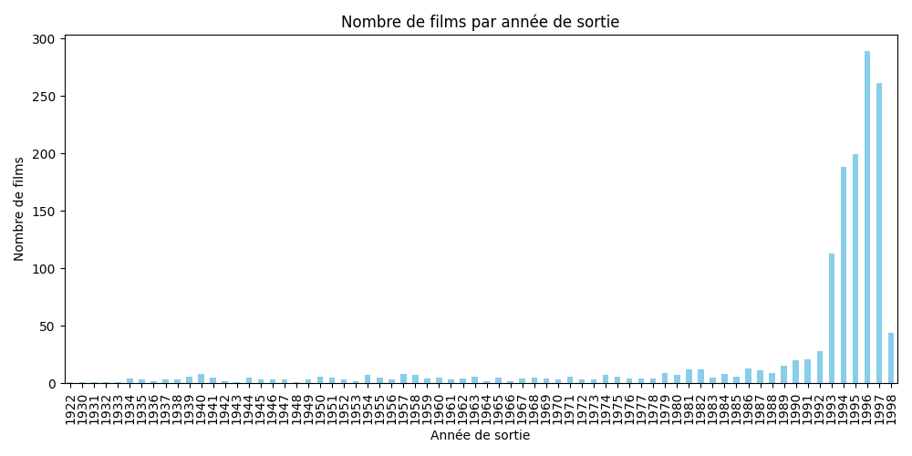  
_On remarque clairement une augmentation significative du nombre de films à partir des années 1980, avec un pic majeur dans les années 1990 (en particulier autour de 1995-1997). Cela confirme que le jeu de données est principalement constitué de films récents, ce qui est cohérent avec le classement des films les plus notés (majoritairement des années 1990)._

**2. Top 10 des films les plus notés**  
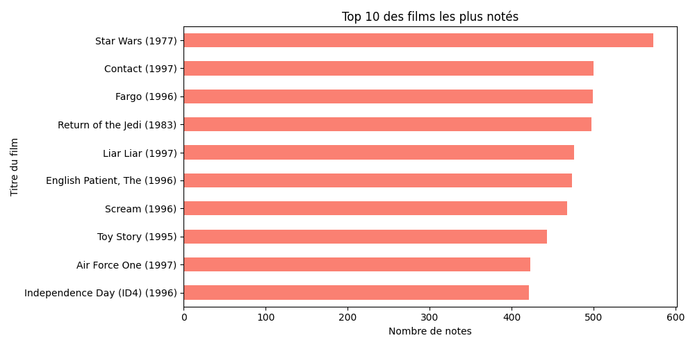  
_On retrouve essentiellement des blockbusters (films à très grand succès commercial et populaire) des années 1990 tels que « Star Wars (1977) », « Contact (1997) », et « Fargo (1996) ». Ce graphique est cohérent avec le graphique par année de sortie, qui montre que les films récents attirent le plus d’attention et de notations de la part des utilisateurs._

**3. Top 10 des films les mieux notés**  
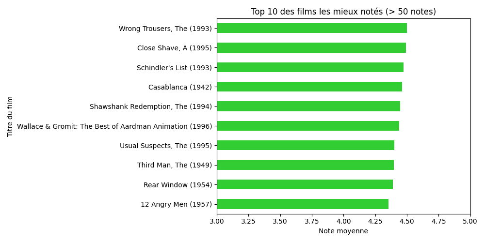 
_Les films les mieux notés sont des grands classiques ou films unanimement appréciés, tels que « Wrong Trousers (1993) », « Schindler's List (1993) » et « Casablanca (1942) ». Ce graphique révèle clairement que les utilisateurs notent généralement très hautement les classiques reconnus, indépendamment de leur ancienneté._

**4. Top 10 des films avec le plus de genres**  
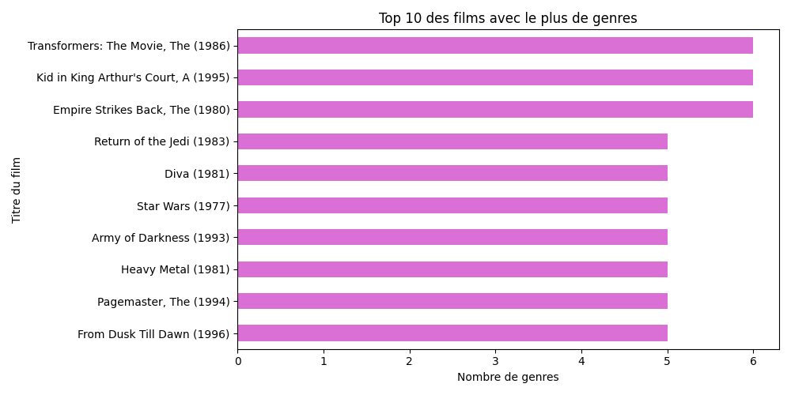  
_Des films tels que « Transformers (1986) » et « Empire Strikes Back (1980) » apparaissent en tête avec jusqu'à 6 genres différents. Cela montre une difficulté à classifier précisément ces films dans une seule catégorie et explique aussi leur large audience et leur popularité._

**5. Distribution des films mono-genre vs multi-genres**  
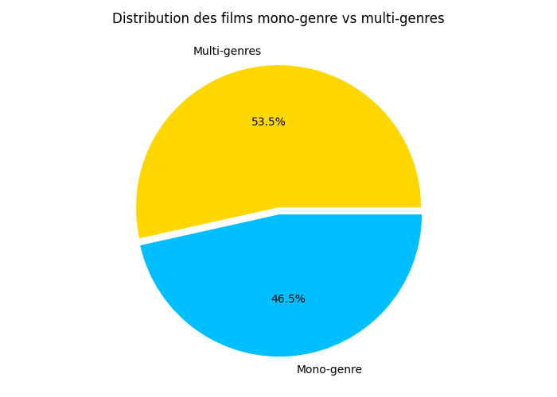 
_Le graphique révèle une répartition relativement équilibrée : 53,5% multi-genres et 46,5% mono-genre. Cette répartition indique une grande diversité dans la catégorisation des films, qui se reflète dans la popularité variée des films et explique pourquoi certains films apparaissent dans les tops de plusieurs genres._
### 2. Analyse des Notes

Cette étape vise à comprendre la distribution des évaluations attribuées par les utilisateurs, à détecter des comportements de notation particuliers, et à identifier des tendances temporelles ou structurelles dans les notations.

**Les points à faire ressortir sont :**

- Le nombre total de notes dans le jeu de données.
- Les statistiques descriptives de la colonne `rating` (moyenne, médiane, écart-type, etc.)
- Le nombre moyen de notes par film.
- La note moyenne des films pour chaque année.
- Comparaison des notes moyennes des films anciens et récents.

**Graphiques produits :**

- Histogramme de la distribution des notes  
- Distribution du nombre de notes par film  
- Évolution des notes moyennes par année  
- Moyenne des notes : films anciens vs récents
####  Code : `analyse_notes.py`

```python
import pandas as pd
import matplotlib.pyplot as plt
import seaborn as sns

# Chargement des données
data = pd.read_csv(r'C:\projet_work\Data-source\merged_final_data.csv')

# Nombre total de notes
total_notes = data.shape[0]
print(f"Nombre total de notes dans la base : {total_notes}")

# Statistiques descriptives des notes
stats_notes = data['rating'].describe()
print("\nStatistiques descriptives des notes :")
print(stats_notes)

# Histogramme de la distribution des notes
plt.figure(figsize=(8,5))
sns.histplot(data['rating'], bins=5, kde=True)
plt.title('Distribution des notes utilisateurs')
plt.xlabel('Notes')
plt.ylabel('Fréquence')
plt.tight_layout()
plt.show()

# Nombre moyen de notes par film
notes_par_film = data.groupby('movie_id').size()
moyenne_notes_film = notes_par_film.mean().round(2)
print(f"\nNombre moyen de notes par film : {moyenne_notes_film}")

# Distribution du nombre de notes par film
plt.figure(figsize=(8,5))
sns.histplot(notes_par_film, bins=30, kde=True, color='lightcoral')
plt.title('Distribution du nombre de notes par film')
plt.xlabel('Nombre de notes')
plt.ylabel('Nombre de films')
plt.tight_layout()
plt.show()

# Note moyenne par année
data['release_date'] = pd.to_datetime(data['release_date'])
data['release_year'] = data['release_date'].dt.year
note_par_annee = data.groupby('release_year')['rating'].mean()
print("\nNote moyenne des films par année (10 premières lignes):")
print(note_par_annee.head(10))

plt.figure(figsize=(12,5))
note_par_annee.plot(marker='o', linestyle='-', color='teal')
plt.title('Évolution de la note moyenne des films par année')
plt.xlabel('Année de sortie')
plt.ylabel('Note moyenne')
plt.grid(True)
plt.tight_layout()
plt.show()

# Films anciens vs récents
data['age_group'] = data['release_year'].apply(lambda x: 'Ancien (<1980)' if x < 1980 else 'Récent (>=1980)')
notes_age_group = data.groupby('age_group')['rating'].mean()
print("\nNote moyenne des films selon ancienneté :")
print(notes_age_group)

plt.figure(figsize=(7,5))
notes_age_group.plot(kind='bar', color=['orange','dodgerblue'])
plt.title('Note moyenne : films anciens vs récents')
plt.ylabel('Note moyenne')
plt.xlabel('Catégorie de film')
plt.xticks(rotation=0)
plt.tight_layout()
plt.show()
#### ▶️ Résultats utiles du script `analyse_notes.py`

```text
Nombre total de notes dans la base : 94276

Statistiques descriptives des notes :
count    94276.000000  
mean         3.556547  
std          1.112641  
min          1.000000  
25%          3.000000  
50%          4.000000  
75%          4.000000  
max          5.000000  

Nombre moyen de notes par film : 64.57

Note moyenne des films par année (10 premières lignes) :
1922    3.580000  
1930    3.875000  
1931    4.075000  
1932    3.833333  
1933    4.034483  
1934    4.033557  
1935    3.931034  
1936    3.727273  
1937    3.739130  
1938    3.894180  

Note moyenne des films selon ancienneté :
Ancien (<1980)     3.923824  
Récent (>=1980)    3.478773
####  Graphiques produits

**1. Distribution des notes utilisateurs**  
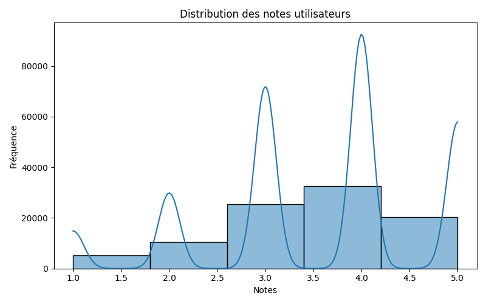 

**2. Distribution du nombre de notes par films**  
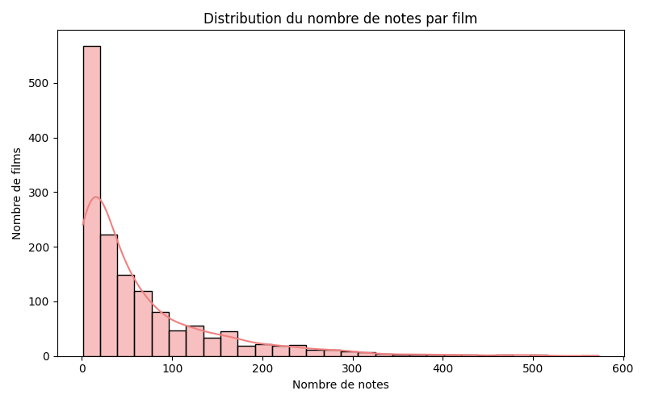 

**3. Évolution des notes moyennes des films par année**  
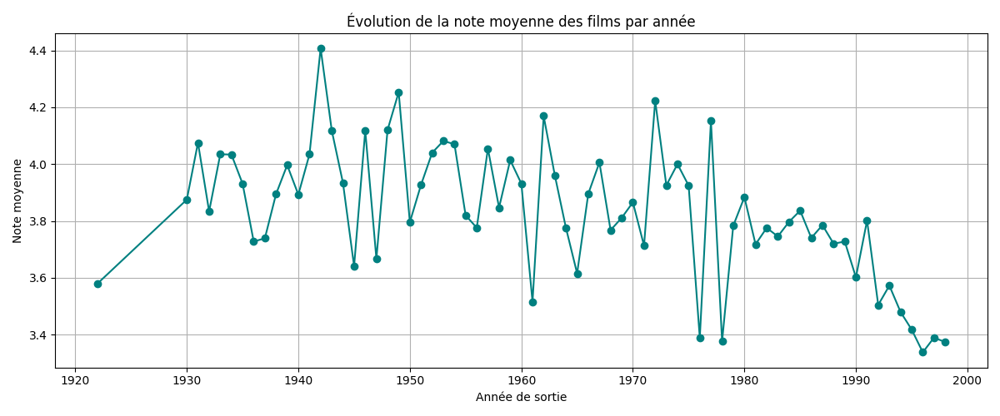 

**4. Note moyenne : films anciens vs récents**  
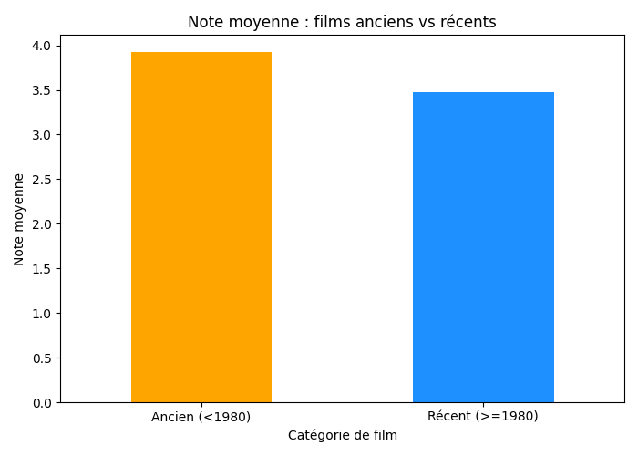 films_anciens_vs_recents.png
###  Synthèse des résultats et graphiques (`analyse_notes.py`)

**Nombre total et distribution des notes :**
- Le dataset contient 94 276 notations, avec une moyenne générale de 3,56/5.
- La majorité des notes attribuées par les utilisateurs se situe entre 3 et 4, indiquant une tendance générale plutôt positive dans les évaluations.

**Distribution du nombre de notes par film :**
- La majorité des films ont très peu de notes (moins de 50 notes), ce qui est typique d'un tel jeu de données où seuls quelques films très populaires concentrent une grande quantité de notations.
- Quelques rares films atteignent un nombre très élevé de notes (jusqu'à environ 600 notes, comme vu précédemment avec « Star Wars (1977) »).

**Évolution des notes moyennes par année :**
- Les films plus anciens (entre 1930-1960) obtiennent généralement des notes moyennes plus élevées.
- À partir des années 1980-1990, on remarque une nette baisse progressive des notes moyennes attribuées aux films, potentiellement due à une diversité croissante de genres et à une audience plus large et critique.

**Note moyenne : films anciens vs récents :**
- Les films anciens (avant 1980) obtiennent une note moyenne plus élevée (3,92) comparativement aux films récents (après 1980), notés en moyenne à 3,48.

---

### 3. Analyse des Genres

**Les points à faire ressortir sont :**

- Le nombre de films pour chaque genre.
- La note moyenne des films pour chaque genre.
- L'évolution de genres spécifiques (par exemple, "Sci-Fi" et "Drama") au fil des décennies.
- La corrélation entre les différents genres.

**Graphiques produits :**

- Un graphique à barres pour visualiser le nombre de films dans chaque genre.  
- Un graphique à barres pour visualiser la note moyenne des films pour chaque genre.  
- Un graphique linéaire pour visualiser l'évolution de genres spécifiques au fil du temps (par décennie).  
- Une heatmap pour visualiser la matrice de corrélation entre les différents genres.

####  Code : `analyse_genres.py`

```python
import pandas as pd
import matplotlib.pyplot as plt
import seaborn as sns

# Chargement des données
data = pd.read_csv(r'C:\projet_work\Data-source\merged_final_data.csv')

# Conversion date de sortie en datetime
data['release_date'] = pd.to_datetime(data['release_date'])
data['release_year'] = data['release_date'].dt.year

genres = ['Action','Adventure','Animation',"Children's",'Comedy','Crime',
          'Documentary','Drama','Fantasy','Film-Noir','Horror','Musical',
          'Mystery','Romance','Sci-Fi','Thriller','War','Western']

# ----------------------- Nombre de films par genre ------------------------
nb_films_genre = {genre: data[data[genre]==1]['movie_id'].nunique() for genre in genres}
nb_films_genre_series = pd.Series(nb_films_genre).sort_values(ascending=False)
print("Nombre de films par genre :")
print(nb_films_genre_series)

plt.figure(figsize=(12,6))
sns.barplot(y=nb_films_genre_series.index, x=nb_films_genre_series.values, palette='mako')
plt.xlabel('Nombre de films')
plt.ylabel('Genre')
plt.title('Nombre de films par genre')
plt.tight_layout()
plt.show()

# ----------------------- Notes moyennes par genre ------------------------
note_genres = {genre: data[data[genre]==1]['rating'].mean() for genre in genres}
note_genres_series = pd.Series(note_genres).sort_values(ascending=False)
print("\nNote moyenne par genre :")
print(note_genres_series)

plt.figure(figsize=(12,6))
sns.barplot(y=note_genres_series.index, x=note_genres_series.values, palette='viridis')
plt.xlabel('Note moyenne')
plt.ylabel('Genre')
plt.title('Note moyenne par genre')
plt.xlim(3,5)
plt.tight_layout()
plt.show()

# ----------------------- Évolution des genres dans le temps ------------------------
data['decade'] = (data['release_year']//10)*10
genres_temps = data.groupby('decade')[['Sci-Fi','Drama']].sum()
print("\nÉvolution des genres 'Sci-Fi' et 'Drama' par décennie :")
print(genres_temps)

genres_temps.plot(kind='line', marker='o', figsize=(10,5))
plt.title('Évolution des genres Sci-Fi et Drama par décennie')
plt.xlabel('Décennie')
plt.ylabel('Nombre de films')
plt.grid(True)
plt.tight_layout()
plt.show()

# ----------------------- Corrélation entre genres ------------------------
correlation_genres = data[genres].corr()
print("\nCorrélation entre genres (extrait) :")
print(correlation_genres.head())

plt.figure(figsize=(14,10))
sns.heatmap(correlation_genres, annot=True, cmap='coolwarm', linewidths=0.5)
plt.title('Heatmap des corrélations entre genres')
plt.tight_layout()
plt.show()

#### ▶️ Résultats du script `analyse_genres.py`

```text
Nombre de films par genre :
Drama          608
Comedy         456
Thriller       230
Romance        228
Action         227
Adventure      130
Children's     119
Sci-Fi          97
Crime           93
Horror          83
War             68
Mystery         57
Musical         55
Animation       42
Documentary     30
Western         25
Film-Noir       21
Fantasy         20

Note moyenne par genre :
Film-Noir      3.946111
War            3.829705
Documentary    3.767267
Drama          3.717208
Mystery        3.655869
Crime          3.655019
Romance        3.642316
Western        3.641748
Animation      3.595398
Sci-Fi         3.576115
Thriller       3.529304
Musical        3.529098
Adventure      3.521315
Action         3.499489
Comedy         3.415981
Children's     3.378061
Horror         3.337219
Fantasy        3.230648

Évolution des genres 'Sci-Fi' et 'Drama' par décennie :
        Sci-Fi  Drama
decade
1920         0      0
1930         0    637
1940         0    740
1950       263   1217
1960       536   1278
1970      1265   1517
1980      3044   4682
1990      7117  27423

Corrélation entre genres (extrait) :
              Action  Adventure  Animation  Children's    Comedy     Crime  ...   Mystery   Romance    Sci-Fi  Thriller       War   Western
Action      1.000000   0.453562  -0.101185   -0.147025 -0.225300  0.005314  ... -0.033760 -0.018278  0.324754  0.249892  0.167365  0.063701
Adventure   0.453562   1.000000  -0.026709    0.096590 -0.112925 -0.031725  ... -0.044118 -0.017517  0.295197 -0.051587  0.087986  0.011085
Animation  -0.101185  -0.026709   1.000000    0.558514  0.032727 -0.057732  ... -0.046010 -0.086526 -0.047056 -0.078560 -0.057961 -0.026649
Children's -0.147025   0.096590   0.558514    1.000000  0.086271 -0.082387  ... -0.055738 -0.119693 -0.044201 -0.144973 -0.086481 -0.031909
Comedy     -0.225300  -0.112925   0.032727    0.086271  1.000000 -0.091057  ... -0.112975  0.094760 -0.146919 -0.292629 -0.121855  0.002660
...

#### Graphiques produits

**1. Nombre de films par genre**  
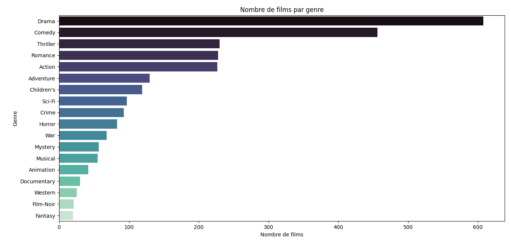      

_Le genre « Drama » domine largement avec le plus grand nombre de films, suivi par Comedy, Action et Thriller. À l’inverse, les genres comme Film-Noir ou Fantasy sont nettement sous-représentés. Ceci montre que le jeu de données privilégie les films à large audience et grand public._

**2. Note moyenne par genre**  
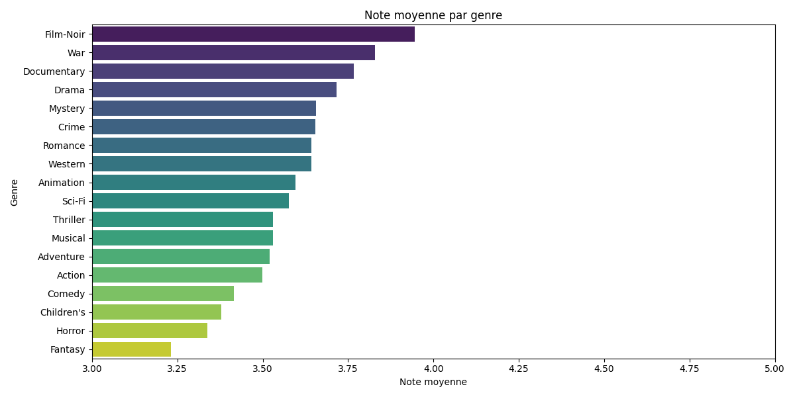  
_Les genres comme Film-Noir, War et Documentary obtiennent les notes moyennes les plus élevées (>3.7). À l’opposé, les genres Horror, Children’s et Comedy obtiennent des notes moyennes plus basses. On en conclut que les utilisateurs valorisent davantage les genres spécialisés, sérieux ou classiques (comme Film-Noir, Documentary) par rapport aux genres très populaires._

**3. Évolution des genres Sci-Fi et Drama par décennie**  
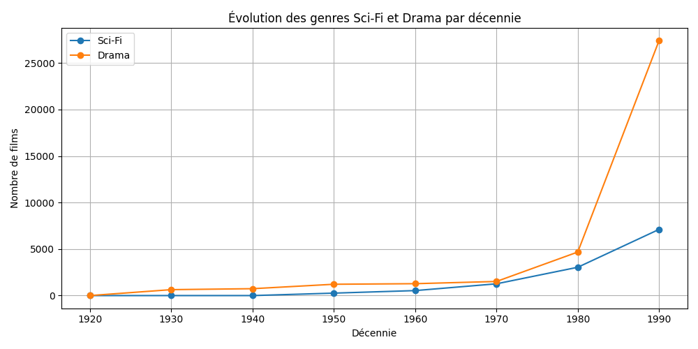  
_Le genre « Drama » connaît une forte augmentation des années 1980-1990, avec une croissance exponentielle en popularité. Sci-Fi augmente également fortement à partir des années 1980, mais reste toujours inférieur en nombre à Drama. Ce résultat reflète clairement l'intérêt croissant pour ces deux genres, surtout le « Drama » dans les décennies récentes._

**4. Heatmap des corrélations entre genres**  
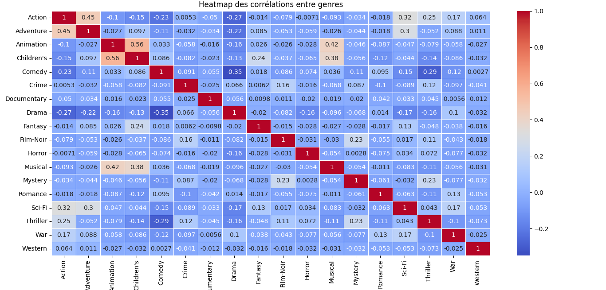  
_La heatmap montre clairement que certains genres sont fréquemment associés. Par exemple :  
- Action & Adventure (forte corrélation : 0.45)  
- Animation & Children's (forte corrélation, logique puisque ces deux genres sont souvent destinés au même public)  
Inversement, des genres comme Film-Noir et Fantasy sont peu associés à d’autres, confirmant leur caractère spécifique.
### 4. Analyse des Utilisateurs

Cette analyse vise à comprendre les comportements des utilisateurs en matière de notation, en identifiant ceux qui attribuent le plus de notes, la distribution de leurs évaluations et la variance de leurs préférences.

#### Points à analyser :
- **Nombre total d'utilisateurs uniques dans le jeu de données**
- **Nombre moyen de notes attribuées par utilisateur**
- **Top 10 des utilisateurs ayant attribué le plus grand nombre de notes**
- **Distribution du nombre de notes attribuées par utilisateur**
- **Variance et moyenne des notes attribuées par utilisateur**

#### Graphiques produits :
- 🔹 **Top 10 des utilisateurs ayant attribué le plus de notes**  
- 🔹 **Histogramme de la distribution des notes moyennes par utilisateur**  
- 🔹 **Histogramme de la distribution des variances des notes attribuées par les utilisateurs**
---

#### Code : `analyse_utilisateurs.py`

```python
import pandas as pd
import matplotlib.pyplot as plt
import seaborn as sns

# Chargement des données
data = pd.read_csv(r'C:\projet_work\Data-source\merged_final_data.csv')

# Nombre total d’utilisateurs
total_users = data['user_id'].nunique()
print(f"Nombre total d'utilisateurs : {total_users}")

# Nombre moyen de notes par utilisateur
notes_par_utilisateur = data.groupby('user_id').size()
moyenne_notes_user = notes_par_utilisateur.mean().round(2)
print(f"\nNombre moyen de notes par utilisateur : {moyenne_notes_user}")

# Utilisateurs les plus actifs
top_utilisateurs_actifs = notes_par_utilisateur.sort_values(ascending=False).head(10)
print("\nTop 10 utilisateurs les plus actifs :")
print(top_utilisateurs_actifs)

# Graphique: Top 10 utilisateurs les plus actifs
plt.figure(figsize=(10,5))
top_utilisateurs_actifs.plot(kind='bar', color='skyblue')
plt.title('Top 10 utilisateurs les plus actifs')
plt.xlabel('User ID')
plt.ylabel('Nombre de notes')
plt.tight_layout()
plt.show()

# Distribution du nombre de notes par utilisateur
plt.figure(figsize=(10,5))
sns.histplot(notes_par_utilisateur, bins=50, kde=True, color='green')
plt.title('Distribution du nombre de notes par utilisateur')
plt.xlabel('Nombre de notes données')
plt.ylabel('Nombre d\'utilisateurs')
plt.tight_layout()
plt.show()

# Variance et Moyenne des notes par utilisateur
stats_users = data.groupby('user_id')['rating'].agg(['mean','var'])
print("\nStatistiques (moyenne et variance) des notes par utilisateur (10 premiers) :")
print(stats_users.head(10))

# Graphique: Distribution des moyennes des notes par utilisateur
plt.figure(figsize=(10,5))
sns.histplot(stats_users['mean'], bins=30, kde=True, color='orange')
plt.title('Distribution des moyennes de notes par utilisateur')
plt.xlabel('Moyenne des notes')
plt.ylabel('Nombre d\'utilisateurs')
plt.tight_layout()
plt.show()

# Graphique: Distribution des variances des notes par utilisateur
plt.figure(figsize=(10,5))
sns.histplot(stats_users['var'].dropna(), bins=30, kde=True, color='red')
plt.title('Distribution des variances des notes par utilisateur')
plt.xlabel('Variance des notes')
plt.ylabel('Nombre d\'utilisateurs')
plt.tight_layout()
plt.show()

---

####  Résultats utiles du script `analyse_utilisateurs.py`

```text
Nombre total d'utilisateurs : 933

Nombre moyen de notes par utilisateur : 101.05

Top 10 utilisateurs les plus actifs :
user_id
279    424
429    414
181    406
846    405
94     400
7      400
682    398
308    396
92     388
293    388

Statistiques (moyenne et variance) des notes par utilisateur (10 premiers) :
             mean       var
user_id
1        3.603704  1.600730
2        3.754098  0.955191
3        2.796296  1.486024
4        4.333333  0.840580
5        2.889535  1.841527
6        3.635071  1.080478
7        3.975000  1.117168
8        3.796610  1.544126
9        4.272727  0.874459
10       4.207650  0.341260
####  Graphiques produits

**1. Top 10 des utilisateurs ayant attribué le plus de notes**  
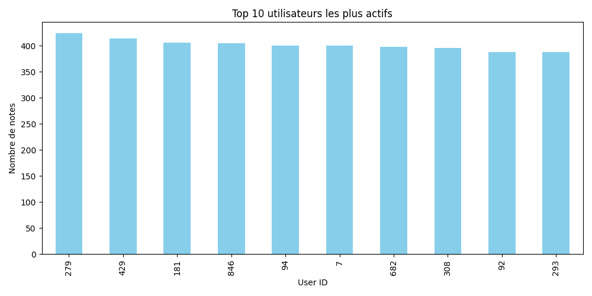  

**2. Distribution du nombre de notes par utilisateur**  
  

**3. Histogramme de la distribution des moyennes des notes par utilisateur**  
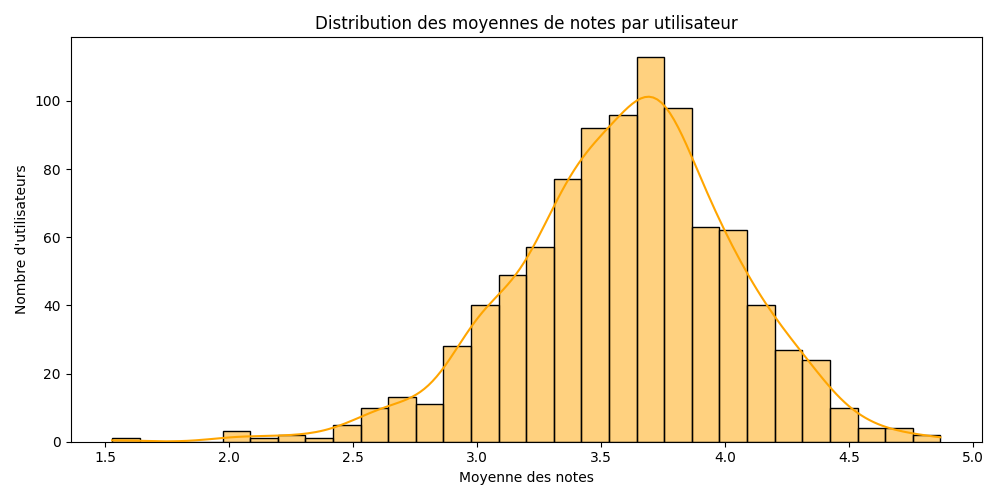  

**4. Histogramme de la distribution des variances des notes par utilisateur**  
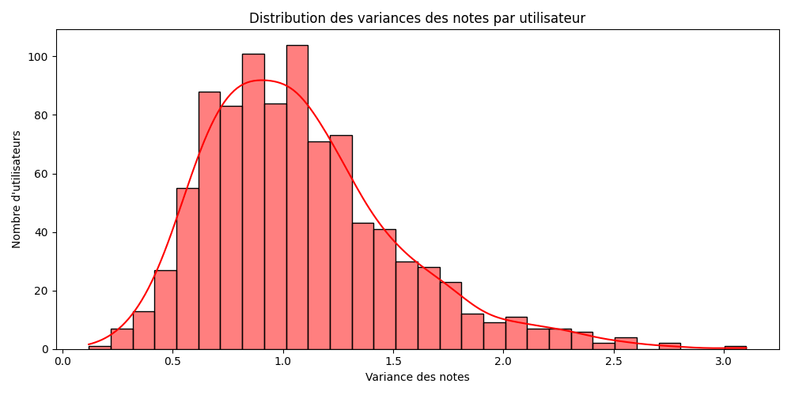  

---

#### Analyse des résultats

**Activité et nombre de notes par utilisateur :**  
- Le dataset comporte **933 utilisateurs**, qui attribuent en moyenne **101 notes chacun**, ce qui indique une **forte activité moyenne** par utilisateur.
- Cependant, la distribution montre que **beaucoup d’utilisateurs notent relativement peu de films**, tandis que **seuls quelques utilisateurs très actifs notent énormément de films** (jusqu’à plus de **400 films notés** pour les utilisateurs les plus actifs).

**Utilisateurs les plus actifs :**  
- Les **10 utilisateurs les plus actifs** notent **entre 388 et 424 films**, révélant **un engagement très élevé** avec la plateforme.

**Distribution des moyennes de notes par utilisateur :**  
- La majorité des utilisateurs ont une **moyenne de notes située entre 3 et 4**, ce qui suggère un **comportement généralement positif et peu critique** des utilisateurs envers les films.
- Cette observation rejoint directement la **distribution générale des notes** vue dans les analyses précédentes.

**Distribution des variances des notes par utilisateur :**  
- La **variance des notes attribuées par utilisateur** est généralement comprise **entre 0,5 et 1,5**, ce qui signifie que la plupart des utilisateurs **donnent des notes variées mais modérées**.
- Peu d’utilisateurs sont **extrêmement constants (faible variance)** ou **extrêmement variés dans leurs notes (haute variance)**.

---
## 📌 Conclusion

Les résultats obtenus à travers l’analyse exploratoire confirment clairement la pertinence des hypothèses formulées :

### ✅ Hypothèse 1 (Similarité utilisateurs) :
Les distributions des moyennes et variances des notes indiquent que **certains utilisateurs partagent effectivement des goûts similaires**, ce qui est une base solide pour les systèmes de recommandation basés sur le **filtrage collaboratif**.

### ✅ Hypothèse 2 (Genres indicateurs fiables) :
Les **corrélations fortes entre certains genres** confirment que **les genres constituent des critères pertinents pour mesurer la similarité entre films**, ce qui est exploitable pour un modèle basé sur le **contenu**.

### ✅ Hypothèse 3 (Tendances globales) :
Les **tendances temporelles et globales des notes** montrent clairement qu'il existe des **préférences dominantes** exploitables pour guider les recommandations, notamment pour les nouveaux utilisateurs.

---

## Perspectives : Vers une Modélisation plus avancée

Toutefois, pour **valider rigoureusement ces hypothèses et améliorer les recommandations**, il serait pertinent d’utiliser des approches plus avancées :

### 🔹 **1. Filtrage Collaboratif**  
- Confirmer plus précisément la **similarité entre utilisateurs** selon leurs notations.  
- Fournir des recommandations **basées sur les goûts d’utilisateurs proches**.

### 🔹 **2. Modèles basés sur le Contenu**  
- Valider l’utilité des **genres** comme critère déterminant de similarité entre films.  
- Exploiter les **métadonnées des films** pour des recommandations plus précises.

### 🔹 **3. Modèle Hybride**  
- Combiner **Filtrage Collaboratif** et **Modèles basés sur le Contenu**.  
- Tirer parti des **forces des deux approches** pour améliorer la pertinence des recommandations.

---

### **Prochaine étape : Implémentation des modèles de recommandation**
L’étape suivante consistera à **implémenter et évaluer ces modèles** pour proposer un **système de recommandation efficace et personnalisé** aux utilisateurs.
## IV & V. Phase de Modélisation et d’Évaluation

Pour cette phase de modélisation du projet, j'ai opté pour l'algorithme **KNN (K-Nearest Neighbors)** en raison de sa **simplicité** et de sa **robustesse** pour mesurer directement la **similarité entre utilisateurs ou films**.

Selon le modèle, le choix de la mesure de similarité a été adapté :

- **Content-Based (Basé sur le Contenu) :**  
  - **Mesure utilisée :** **Distance Cosinus**  
  - Pourquoi ? → Permet de comparer efficacement les **vecteurs de caractéristiques (genres de films)**.

- **Collaboratif (User-User et Item-Item) :**  
  - **Mesures testées :** **Distances Euclidienne & Manhattan**  
  - Pourquoi ? → Ces distances se sont révélées **particulièrement performantes** pour capturer les variations des notations.

---

### Processus de Modélisation

Pour chaque approche, j'ai suivi un processus **structuré** comprenant :

1️⃣ **Préparation des données**  
   - Création de matrices **Utilisateur-Film** et **Film-Utilisateur**.  
   - Extraction des **caractéristiques de contenu**.

2️⃣ **Entraînement du modèle KNN**   
   - Optimisation des **hyperparamètres**.  
   - Test de différentes **mesures de distance**.

3️⃣ **Évaluation du modèle**   
   - **Métrique utilisée :** **RMSE (Root Mean Squared Error)**.  
   - Sélection du **modèle le plus performant**.  

 **Résultat final :**  
**Le modèle Item-Item KNN s'est avéré être le plus performant.**  
Il a été **déployé dans une application interactive et une API**, garantissant ainsi **des recommandations pertinentes et fiables**.

---

## 🔹 f. Préparation des données pour la matrice utilisateur-item

Cette matrice représente les **interactions utilisateur-film**, où **chaque cellule** indique la **note donnée par un utilisateur à un film**.  

✅ **Objectif :** Transformer les **données brutes** (utilisateurs, films, notes) en une **structure matricielle optimisée**, facilitant :
- L’analyse des relations entre films et utilisateurs.
- L’application d’algorithmes de recommandation basés sur la **similarité**.

---

####  Code : `preparation_matrice.py`

```python
import pandas as pd

# Chargement des données
data = pd.read_csv(r'C:\projet_work\Data-source\merged_final_data.csv')

# Création de la matrice User-Item
user_item_matrix = data.pivot_table(index='user_id', columns='movie_title', values='rating').fillna(0)

# Sauvegarde de la matrice
user_item_matrix.to_csv(r'C:\projet_work\Data-source\user_item_matrix.csv')

print("Matrice User-Item créée avec succès.")

## 🔹 g. Implémentation de KNN pour le Filtrage Collaboratif

Le **filtrage collaboratif** repose sur le principe que **des utilisateurs ayant exprimé des préférences similaires dans le passé continueront de partager des goûts comparables à l'avenir**.  

Pour mettre en œuvre ce concept, **deux modèles distincts** ont été développés :

### 1️⃣ **Modèle User-User (Collaboratif basé sur les utilisateurs)**
🔹 **Principe :** Identifie les utilisateurs ayant un comportement similaire.  
🔹 **Recommandation :** Suggère des films qu'ils ont appréciés, mais que l'utilisateur cible n'a pas encore vus.

### 2️⃣ **Modèle Item-Item (Collaboratif basé sur les films)**
🔹 **Principe :** Analyse la similarité entre les films eux-mêmes.  
🔹 **Recommandation :** Propose des titres similaires aux films que l'utilisateur a déjà appréciés.

## 🔹 Modèle User-User : Création

Le modèle **User-User KNN** repose sur l'idée que **des utilisateurs ayant des préférences similaires ont tendance à aimer les mêmes films**.  
Grâce à l’algorithme **KNN (K-Nearest Neighbors)**, nous identifions les **10 utilisateurs les plus proches** et nous générons des recommandations basées sur leurs préférences.

---

####  Code : `modele_user_user.py`

```python
import pandas as pd
import numpy as np
from sklearn.neighbors import NearestNeighbors
import joblib

# Chargement et préparation des données
data = pd.read_csv(r'C:\projet_work\Data-source\merged_final_data.csv')
user_item_matrix = data.pivot_table(index='user_id', columns='movie_title', values='rating', fill_value=0)

# Entraînement du modèle KNN User-User
model_knn = NearestNeighbors(metric='cosine', algorithm='brute', n_neighbors=10)
model_knn.fit(user_item_matrix.values)

# Sauvegarde du modèle entraîné
model_path = r'C:\projet_work\Data-source\user_user_knn_model.pkl'
pd.to_pickle(model_knn, model_path)

# Fonction de recommandation 
def recommander_films(user_id, matrice, model_knn, n_reco=5):
    user_index = matrice.index.get_loc(user_id)
    distances, indices = model_knn.kneighbors([matrice.iloc[user_index].values], n_neighbors=10)
    voisins = matrice.iloc[indices[0]]
    moyenne_voisins = voisins.mean(axis=0)
    
    deja_notes = matrice.iloc[user_index] > 0
    recommandations = moyenne_voisins[~deja_notes].sort_values(ascending=False).head(n_reco)
    return recommandations

# Exemple pour utilisateur ID=1
user_id = 1
recommandations = recommander_films(user_id, user_item_matrix, model_knn, n_reco=5)

print("\nModèle User-User KNN créé avec succès")
print(f"Recommandations finales pour l'utilisateur {user_id} :")
print(recommandations)

---

#### ▶️ Résultats de l’exécution

```bash
PS C:\projet_work\Script> python modele_user_user.py
Modèle User-User KNN créé avec succès
Recommandations finales pour l'utilisateur 1 :
movie_title
Schindler's List (1993)                                                        3.6
Dr. Strangelove or: How I Learned to Stop Worrying and Love the Bomb (1963)    3.4
E.T. the Extra-Terrestrial (1982)                                              3.3
Dave (1993)                                                                    3.3
Stand by Me (1986)                                                             3.3
dtype: float64

Bref commentaire :
Le modèle User-User KNN a été créé avec succès et a fourni un exemple concret de recommandations pour l'utilisateur 1, illustrant son fonctionnement et sa capacité à identifier des préférences basées sur les utilisateurs similaires.
## 🔹 Modèle User-User : Évaluation

Après l'entraînement du modèle **User-User KNN**, il est essentiel d’évaluer sa précision en mesurant **l’erreur de prédiction** sur un ensemble de test.

📌 **Métrique utilisée :**  
➡️ **RMSE (Root Mean Squared Error)** : Cette métrique mesure **l’écart moyen** entre les notes prédites et les notes réelles.  
Plus la **valeur du RMSE est faible**, plus le modèle est précis.

---

####  Code : `evaluation_modele_user_user.py`

```python
import pandas as pd
import numpy as np
from sklearn.neighbors import NearestNeighbors
from sklearn.metrics import mean_squared_error
from sklearn.model_selection import train_test_split

# Chargement des données
data = pd.read_csv(r'C:\projet_work\Data-source\merged_final_data.csv')

# Création matrice user-item
user_item_matrix = data.pivot_table(index='user_id', columns='movie_title', values='rating', fill_value=0)

# Split en train/test
train_data, test_data = train_test_split(data, test_size=0.2, random_state=42)

# Matrices train/test
train_matrix = train_data.pivot_table(index='user_id', columns='movie_title', values='rating', fill_value=0)
test_matrix = test_data.pivot_table(index='user_id', columns='movie_title', values='rating', fill_value=0)

# Modèle KNN entraîné
model_knn = NearestNeighbors(metric='cosine', algorithm='brute', n_neighbors=10)
model_knn.fit(train_matrix.values)

# Fonction prédiction 
def predire_notes(user_id, film, train_matrix, model_knn):
    if user_id not in train_matrix.index or film not in train_matrix.columns:
        return np.nan
    user_index = train_matrix.index.get_loc(user_id)
    distances, indices = model_knn.kneighbors([train_matrix.iloc[user_index].values], n_neighbors=10)
    voisins = train_matrix.iloc[indices[0]]
    prediction = voisins[film][voisins[film] > 0].mean()
    return prediction if not np.isnan(prediction) else np.nan

# Évaluation RMSE 
predictions = []
truths = []

for user_id, film in test_data[['user_id', 'movie_title']].itertuples(index=False):
    true_rating = test_matrix.loc[user_id, film]
    pred_rating = predire_notes(user_id, film, train_matrix, model_knn)
    
    if not np.isnan(pred_rating):
        predictions.append(pred_rating)
        truths.append(true_rating)

# Calcul final du RMSE
mse = mean_squared_error(truths, predictions)
rmse = np.sqrt(mse)

print(f"\n RMSE du modèle User-User KNN : {rmse:.3f}")

---

#### ▶️ Résultats de l’exécution

```bash
PS C:\projet_work\Script> python evaluation_modele_user_user.py
RMSE du modèle User-User KNN : 1.112
## 🔹 Modèle Item-Item : Création

Le modèle **Item-Item KNN** repose sur l'idée que **des films similaires sont souvent appréciés par les mêmes utilisateurs**.  
En utilisant l’algorithme **KNN (K-Nearest Neighbors)**, nous trouvons les films **les plus proches** d’un film donné, afin de générer des recommandations **basées sur la similarité entre films**.

---

####  Code : `modele_item_item.py`

```python
import pandas as pd
import numpy as np
from sklearn.neighbors import NearestNeighbors
import joblib

# Chargement des données
data = pd.read_csv(r'C:\projet_work\Data-source\merged_final_data.csv')

# Matrice item-user (transpose user-item pour item-item)
item_user_matrix = data.pivot_table(index='movie_title', columns='user_id', values='rating', fill_value=0)

# Entraînement du modèle KNN Item-Item (cosine)
model_knn_item = NearestNeighbors(metric='cosine', algorithm='brute', n_neighbors=10)
model_knn_item.fit(item_user_matrix.values)

# Sauvegarde du modèle Item-Item
model_path = r'C:\projet_work\Model\item_item_knn_model.pkl'
joblib.dump(model_knn_item, model_path)

# Fonction de recommandation Item-Item
def recommander_films_similaires(titre_film, matrice, model_knn, n_reco=5):
    if titre_film not in matrice.index:
        return "Film non trouvé."

    film_index = matrice.index.get_loc(titre_film)
    distances, indices = model_knn.kneighbors([matrice.iloc[film_index].values], n_neighbors=n_reco + 1)

    recommandations = matrice.index[indices.flatten()[1:]]  # exclure le film recherché
    return recommandations

# Exemple d'utilisation pour le film "Star Wars (1977)"
titre_film = "Star Wars (1977)"
recommandations = recommander_films_similaires(titre_film, item_user_matrix, model_knn_item, n_reco=5)

print("\nModèle Item-Item KNN créé avec succès")
print(f"\n🎬 Films similaires recommandés pour '{titre_film}':")
print(recommandations)

---

#### ▶️ Résultats de l’exécution

```bash
PS C:\projet_work\Script> python modele_item_item.py
Modèle Item-Item KNN créé avec succès

Films similaires recommandés pour 'Star Wars (1977)':
Index(['Return of the Jedi (1983)', 'Raiders of the Lost Ark (1981)',
       'Empire Strikes Back, The (1980)', 'Toy Story (1995)',
       'Godfather, The (1972)'],
      dtype='object', name='movie_title')
Bref commentaire :
Le modèle Item-Item KNN a été créé avec succès et a fourni un exemple concret de recommandations pour "Star Wars (1977)", incluant notamment "Return of the Jedi (1983)", "Raiders of the Lost Ark (1981)", "Empire Strikes Back, The (1980)", "Toy Story (1995)" et "Godfather, The (1972)".
## 🔹 Modèle Item-Item : Évaluation

---

####  Code : `evaluation_modele_item_item.py`

```python
import pandas as pd
import numpy as np
from sklearn.neighbors import NearestNeighbors
from sklearn.metrics import mean_squared_error
from sklearn.model_selection import train_test_split

# Chargement des données
data = pd.read_csv(r'C:\projet_work\Data-source\merged_final_data.csv')

# Split en train/test
train_data, test_data = train_test_split(data, test_size=0.2, random_state=42)

# Matrices item-user (train et test)
train_matrix = train_data.pivot_table(index='movie_title', columns='user_id', values='rating', fill_value=0)
test_matrix = test_data.pivot_table(index='movie_title', columns='user_id', values='rating', fill_value=0)

# Entraînement du modèle
model_knn_item = NearestNeighbors(metric='cosine', algorithm='brute', n_neighbors=10)
model_knn_item.fit(train_matrix.values)

# Fonction prédiction Item-Item
def predire_notes_item(film, user_id, train_matrix, model_knn):
    if film not in train_matrix.index or user_id not in train_matrix.columns:
        return np.nan
    
    film_index = train_matrix.index.get_loc(film)
    distances, indices = model_knn.kneighbors([train_matrix.iloc[film_index].values], n_neighbors=10)
    voisins = train_matrix.iloc[indices[0]]
    prediction = voisins[user_id][voisins[user_id] > 0].mean()
    
    return prediction if not np.isnan(prediction) else np.nan

# Évaluation RMSE 
predictions, truths = [], []

for film, user_id in test_data[['movie_title', 'user_id']].itertuples(index=False):
    true_rating = test_matrix.loc[film, user_id]
    pred_rating = predire_notes_item(film, user_id, train_matrix, model_knn_item)

    if not np.isnan(pred_rating):
        predictions.append(pred_rating)
        truths.append(true_rating)

# Calcul RMSE
mse = mean_squared_error(truths, predictions)
rmse = np.sqrt(mse)

print(f"\n RMSE du modèle Item-Item KNN : {rmse:.3f}")

---

#### ▶️ Résultats de l’exécution

```bash
PS C:\projet_work\Script> python evaluation_modele_item_item.py
RMSE du modèle Item-Item KNN : 1.031
✅ Ces résultats montrent que le modèle Item-Item KNN est plus performant et qu'il capture mieux les relations entre films.
## 🔹h. Modèle basé sur le Contenu (Genres) : Création

Le modèle **Content-Based KNN** repose sur l'idée que **des films partageant des caractéristiques similaires (comme les genres) seront appréciés par les mêmes utilisateurs**.  
En utilisant **KNN (K-Nearest Neighbors)**, nous identifions **les films les plus proches** d’un film donné **en fonction de leurs genres**.

---

####  Code : `modele_content_based.py`

```python
import pandas as pd
import numpy as np
from sklearn.neighbors import NearestNeighbors
import joblib

# Chargement des données
movies = pd.read_csv(r'C:\projet_work\Data-source\clean_movie.csv')

# Sélection des colonnes de genres uniquement
genres = ['Action','Adventure','Animation',"Children's",'Comedy','Crime',
          'Documentary','Drama','Fantasy','Film-Noir','Horror','Musical',
          'Mystery','Romance','Sci-Fi','Thriller','War','Western']

movie_genres_matrix = movies.set_index('movie_title')[genres]

# Entraînement du modèle KNN Content-Based (cosine)
model_knn_content = NearestNeighbors(metric='cosine', algorithm='brute', n_neighbors=10)
model_knn_content.fit(movie_genres_matrix.values)

# Sauvegarde du modèle
model_path = r'C:\projet_work\Model\content_based_knn_model.pkl'
joblib.dump(model_knn_content, model_path)

# Fonction de recommandation basée sur contenu (genres)
def recommander_films_par_genres(titre_film, matrice_genres, model_knn, n_reco=5):
    if titre_film not in matrice_genres.index:
        return "Film non trouvé."

    film_index = matrice_genres.index.get_loc(titre_film)
    distances, indices = model_knn.kneighbors([matrice_genres.iloc[film_index].values], n_neighbors=n_reco + 1)
    recommandations = matrice_genres.index[indices.flatten()[1:]]
    
    return recommandations

# Exemple d'utilisation pour le film "Star Wars (1977)"
titre_film = "Star Wars (1977)"
recommandations = recommander_films_par_genres(titre_film, movie_genres_matrix, model_knn_content, n_reco=5)

print("\nModèle Content_based_recommandation créé avec succès")
print(f"\n🎬 Films similaires recommandés à '{titre_film}' (Content-Based) :")
print(recommandations)

---

#### ▶️ Résultats de l’exécution

```bash
PS C:\projet_work\Script> python modele_content_based.py
Modèle Content_based_recommandation créé avec succès
Films similaires recommandés à 'Star Wars (1977)' (Content-Based) :
Index(['Return of the Jedi (1983)', 'Empire Strikes Back, The (1980)',
       'African Queen, The (1951)', 'Starship Troopers (1997)',
       'Star Trek V: The Final Frontier (1989)'],
      dtype='object', name='movie_title')
Bref commentaire :
Le modèle Content-Based KNN a été créé avec succès.
Pour "Star Wars (1977)", il recommande des films partageant des caractéristiques de contenu similaires, tels que :

"Return of the Jedi (1983)", "Empire Strikes Back, The (1980)","African Queen, The (1951)","Starship Troopers (1997)","Star Trek V: The Final Frontier (1989)".

## 🔹 Modèle basé sur le Contenu (Genres) : Évaluation

Après l'entraînement du modèle **Content-Based KNN**, il est essentiel d’évaluer sa précision en mesurant **l’erreur de prédiction** sur un ensemble de test.

📌 **Métrique utilisée :**  
➡️ **RMSE (Root Mean Squared Error)** : Cette métrique mesure **l’écart moyen** entre les notes prédites et les notes réelles.  
Plus la **valeur du RMSE est faible**, plus le modèle est précis.

---

#### Code : `evaluation_modele_content_based.py`

```python
import pandas as pd
import numpy as np
from sklearn.neighbors import NearestNeighbors
from sklearn.metrics import mean_squared_error
from sklearn.model_selection import train_test_split

# Chargement des données
data = pd.read_csv(r'C:\projet_work\Data-source\merged_final_data.csv')
movies = pd.read_csv(r'C:\projet_work\Data-source\clean_movie.csv')

genres = ['Action','Adventure','Animation',"Children's",'Comedy','Crime',
          'Documentary','Drama','Fantasy','Film-Noir','Horror','Musical',
          'Mystery','Romance','Sci-Fi','Thriller','War','Western']

# Suppression des doublons avant création de la matrice genre
movies_unique = movies.drop_duplicates(subset='movie_title').set_index('movie_title')

# Matrice genre sans doublons
movie_genres_matrix = movies_unique[genres]

# Entraînement du modèle KNN Content-Based
model_knn_content = NearestNeighbors(metric='cosine', algorithm='brute', n_neighbors=10)
model_knn_content.fit(movie_genres_matrix.values)

# Split train/test
train_data, test_data = train_test_split(data, test_size=0.2, random_state=42)

#  Fonction de prédiction
def predire_notes_content(user_id, film, train_data, genres_matrix, model_knn):
    films_notes_user = train_data[train_data['user_id'] == user_id].groupby('movie_title')['rating'].mean()

    if film not in genres_matrix.index:
        return np.nan

    film_vector = genres_matrix.loc[film].values.reshape(1, -1)
    distances, indices = model_knn.kneighbors(film_vector, n_neighbors=10)
    films_similaires = genres_matrix.index[indices.flatten()[1:]]

    notes_similaires = films_notes_user[films_notes_user.index.isin(films_similaires)]
    
    pred_rating = notes_similaires.mean() if not notes_similaires.empty else np.nan
    return pred_rating

#  Évaluation avec RMSE
predictions, truths = [], []

for user_id, film, true_rating in test_data[['user_id', 'movie_title', 'rating']].itertuples(index=False):
    pred_rating = predire_notes_content(user_id, film, train_data, movie_genres_matrix, model_knn_content)
    if not np.isnan(pred_rating):
        predictions.append(pred_rating)
        truths.append(true_rating)

# Calcul du RMSE
rmse = np.sqrt(mean_squared_error(truths, predictions))

print(f"\n RMSE du modèle Content-Based KNN : {rmse:.3f}")

---

#### ▶️ Résultats de l’exécution

```bash
PS C:\projet_work\Script> python evaluation_modele_content_based.py
RMSE du modèle Content-Based KNN : 1.266
Comparé aux modèles User-User et Item-Item KNN, ce modèle a un RMSE plus élevé, ce qui signifie qu'il est moins précis pour prédire les notes exactes.
## 🔹i. Modèle Hybride Content-User : Création

Le modèle **Hybrid Content-User KNN** combine **deux sources d’information** :
- 🔹 **Les similarités entre films (Content-Based)** : En se basant sur les **genres** pour identifier des films similaires.
- 🔹 **Les similarités entre utilisateurs (User-User)** : En trouvant des **utilisateurs proches ayant des goûts similaires**.

📌 **Objectif :** Améliorer la pertinence des recommandations en **fusionnant les préférences des utilisateurs avec la similarité des films**.

---

####  Code : `modele_hybrid_content_user.py`

```python
import pandas as pd
import numpy as np
from sklearn.neighbors import NearestNeighbors
import joblib

# Chargement des données
data = pd.read_csv(r'C:\projet_work\Data-source\merged_final_data.csv')
movies = pd.read_csv(r'C:\projet_work\Data-source\clean_movie.csv')

# Définition des genres
genres = ['Action','Adventure','Animation',"Children's",'Comedy','Crime',
          'Documentary','Drama','Fantasy','Film-Noir','Horror','Musical',
          'Mystery','Romance','Sci-Fi','Thriller','War','Western']

# Matrice des genres (Content-Based)
movies_unique = movies.drop_duplicates(subset='movie_title').set_index('movie_title')
movie_genres_matrix = movies_unique[genres]

# Matrice utilisateur-film (User-User)
user_item_matrix = data.pivot_table(index='user_id', columns='movie_title', values='rating', fill_value=0)

# Modèle Content-Based
model_knn_content = NearestNeighbors(metric='cosine', algorithm='brute', n_neighbors=10)
model_knn_content.fit(movie_genres_matrix.values)

# Modèle User-User
model_knn_user = NearestNeighbors(metric='cosine', algorithm='brute', n_neighbors=10)
model_knn_user.fit(user_item_matrix.values)

# Sauvegarde des modèles
joblib.dump(model_knn_content, r'C:\projet_work\Model\hybrid_content_knn.pkl')
joblib.dump(model_knn_user, r'C:\projet_work\Model\hybrid_user_knn.pkl')

# Fonction de recommandation hybride
def recommander_films_hybride(user_id, film, user_matrix, genre_matrix, model_knn_user, model_knn_content, n_reco=5):
    if film not in genre_matrix.index or user_id not in user_matrix.index:
        return "Utilisateur ou film non trouvé."

    # Phase 1 : Recommandation Content-Based (Films similaires)
    film_vector = genre_matrix.loc[film].values.reshape(1, -1)
    _, indices_film = model_knn_content.kneighbors(film_vector, n_neighbors=10)
    films_similaires = genre_matrix.index[indices_film.flatten()[1:]]

    # Phase 2 : Recommandation User-User (Utilisateurs similaires)
    user_vector = user_matrix.loc[user_id].values.reshape(1, -1)
    _, indices_user = model_knn_user.kneighbors(user_vector, n_neighbors=10)
    users_similaires = user_matrix.index[indices_user.flatten()[1:]]

    # Fusion des recommandations : Films similaires notés par utilisateurs similaires
    films_recommandes = user_matrix.loc[users_similaires][films_similaires].mean().sort_values(ascending=False).head(n_reco)

    return films_recommandes

#  Exemple de recommandation hybride
user_id = 1
titre_film = "Star Wars (1977)"
recommandations = recommander_films_hybride(user_id, titre_film, user_item_matrix, movie_genres_matrix, model_knn_user, model_knn_content)
print("\nModèle Hybrid-Content-user recommandation créé avec succès")
print(f"\n Films recommandés à l'utilisateur {user_id} en hybride avec '{titre_film}':")
print(recommandations)

---

#### ▶️ Résultats de l’exécution

```bash
PS C:\projet_work\Script> python modele_hybrid_content_user.py
Modèle Hybrid-Content-user recommandation créé avec succès

 Films recommandés à l'utilisateur 1 en hybride avec 'Star Wars (1977)':
movie_title
Empire Strikes Back, The (1980)    4.777778
Return of the Jedi (1983)          4.333333
Jurassic Park (1993)               3.666667
Star Trek: Generations (1994)      2.222222
Stargate (1994)                    2.111111
dtype: float64

Bref commentaire :
Le modèle Hybrid-Content-User KNN a été créé avec succès, fournissant pour l'utilisateur 1 des recommandations basées sur une combinaison des similarités de contenu et des préférences utilisateurs.
Les résultats, incluant des titres comme "Empire Strikes Back, The (1980)" et "Return of the Jedi (1983)", démontrent la capacité du modèle à fusionner efficacement ces deux approches.

## 🔹 Modèle Hybride Content-User : Évaluation

Après l'entraînement du modèle **Hybrid Content-User KNN**, il est essentiel d’évaluer sa précision en mesurant **l’erreur de prédiction** sur un ensemble de test.

📌 **Métrique utilisée :**  
➡️ **RMSE (Root Mean Squared Error)** : Cette métrique mesure **l’écart moyen** entre les notes prédites et les notes réelles.  
Plus la **valeur du RMSE est faible**, plus le modèle est précis.

---

####  Code : `evaluation_modele_hybrid_content_user.py`

```python
import pandas as pd
import numpy as np
from sklearn.neighbors import NearestNeighbors
from sklearn.metrics import mean_squared_error
from sklearn.model_selection import train_test_split
import joblib

# Chargement des données
data = pd.read_csv(r'C:\projet_work\Data-source\merged_final_data.csv')
movies = pd.read_csv(r'C:\projet_work\Data-source\clean_movie.csv')

genres = ['Action','Adventure','Animation',"Children's",'Comedy','Crime',
          'Documentary','Drama','Fantasy','Film-Noir','Horror','Musical',
          'Mystery','Romance','Sci-Fi','Thriller','War','Western']

# Matrice des genres (Content-Based)
movies_unique = movies.drop_duplicates(subset='movie_title').set_index('movie_title')
movie_genres_matrix = movies_unique[genres]

# Matrice utilisateur-film (User-User)
user_item_matrix = data.pivot_table(index='user_id', columns='movie_title', values='rating', fill_value=0)

# Chargement des modèles sauvegardés
model_knn_content = joblib.load(r'C:\projet_work\Model\hybrid_content_knn.pkl')
model_knn_user = joblib.load(r'C:\projet_work\Model\hybrid_user_knn.pkl')

# Fonction d’évaluation
def predire_notes_hybride(user_id, film, user_matrix, genre_matrix, model_knn_user, model_knn_content):
    if film not in genre_matrix.index or user_id not in user_matrix.index:
        return np.nan

    # Phase 1 : Films similaires (Content-Based)
    film_vector = genre_matrix.loc[film].values.reshape(1, -1)
    _, indices_film = model_knn_content.kneighbors(film_vector, n_neighbors=10)
    films_similaires = genre_matrix.index[indices_film.flatten()[1:]]

    # Phase 2 : Utilisateurs similaires (User-User)
    user_vector = user_matrix.loc[user_id].values.reshape(1, -1)
    _, indices_user = model_knn_user.kneighbors(user_vector, n_neighbors=10)
    users_similaires = user_matrix.index[indices_user.flatten()[1:]]

    # Fusion : Notes des utilisateurs similaires sur films similaires
    notes_similaires = user_matrix.loc[users_similaires, films_similaires].mean()
    prediction = notes_similaires.mean() if not notes_similaires.empty else np.nan

    return prediction

# Évaluation RMSE
train_data, test_data = train_test_split(data, test_size=0.2, random_state=42)

predictions, truths = [], []

for user_id, film, true_rating in test_data[['user_id', 'movie_title', 'rating']].itertuples(index=False):
    pred_rating = predire_notes_hybride(user_id, film, user_item_matrix, movie_genres_matrix, model_knn_user, model_knn_content)
    
    if not np.isnan(pred_rating):
        predictions.append(pred_rating)
        truths.append(true_rating)

# Calcul du RMSE
rmse = np.sqrt(mean_squared_error(truths, predictions))
print(f"\n RMSE du modèle Hybrid Content-User KNN : {rmse:.3f}")

---

#### ▶️ Résultats de l’exécution

```bash
PS C:\projet_work\Script> python evaluation_modele_hybrid_content_user.py
RMSE du modèle Hybrid Content-User KNN : 3.115
l’écart moyen entre les notes prédites par le modèle et les notes réelles est assez élevé, ce qui suggère que ce modèle hybride n'est pas aussi précis que les autres modèles testés.
## 🔹 Modèle Hybride Content-Item : Création

Le modèle **Hybrid Content-Item KNN** combine **deux types de similarités** :
- 🔹 **Les similarités de contenu (Content-Based)** : En comparant les **genres** des films.
- 🔹 **Les similarités de notation des utilisateurs (Item-Item Collaborative Filtering)** : En identifiant **les films notés de manière similaire**.

📌 **Objectif :** Améliorer la précision des recommandations en combinant **deux sources d'information** pour identifier des films pertinents.

---

####  Code : `modele_hybrid_content_item.py`

```python
import pandas as pd
import numpy as np
from sklearn.neighbors import NearestNeighbors
import joblib

# Chargement des données
data = pd.read_csv(r'C:\projet_work\Data-source\merged_final_data.csv')
movies = pd.read_csv(r'C:\projet_work\Data-source\clean_movie.csv')

# Définition des genres
genres = ['Action','Adventure','Animation',"Children's",'Comedy','Crime',
          'Documentary','Drama','Fantasy','Film-Noir','Horror','Musical',
          'Mystery','Romance','Sci-Fi','Thriller','War','Western']

# Matrice des genres (Content-Based)
movies_unique = movies.drop_duplicates(subset='movie_title').set_index('movie_title')
movie_genres_matrix = movies_unique[genres]

# Matrice film-utilisateur (Item-Item)
item_user_matrix = data.pivot_table(index='movie_title', columns='user_id', values='rating', fill_value=0)

# Vérifier si `Star Wars (1977)` est bien dans les matrices
print(f"'Star Wars (1977)' dans Content-Based : {'Star Wars (1977)' in movie_genres_matrix.index}")
print(f"'Star Wars (1977)' dans Item-Item : {'Star Wars (1977)' in item_user_matrix.index}")

# Modèle Content-Based
model_knn_content = NearestNeighbors(metric='cosine', algorithm='brute', n_neighbors=10)
model_knn_content.fit(movie_genres_matrix.values)

# Modèle Item-Item
model_knn_item = NearestNeighbors(metric='cosine', algorithm='brute', n_neighbors=10)
model_knn_item.fit(item_user_matrix.values)

# Sauvegarde des modèles
joblib.dump(model_knn_content, r'C:\projet_work\Model\hybrid_content_knn.pkl')
joblib.dump(model_knn_item, r'C:\projet_work\Model\hybrid_item_knn.pkl')

# Fonction de recommandation hybride (Content + Item)
def recommander_films_hybride_item(film, item_matrix, genre_matrix, model_knn_item, model_knn_content, n_reco=5):
    if film not in genre_matrix.index or film not in item_matrix.index:
        return "Film non trouvé."

    # Phase 1 : Recommandation Content-Based (Films similaires en genre)
    film_vector = genre_matrix.loc[film].values.reshape(1, -1)
    _, indices_film_content = model_knn_content.kneighbors(film_vector, n_neighbors=10)
    films_similaires_content = genre_matrix.index[indices_film_content.flatten()[1:]]

    # Phase 2 : Recommandation Item-Item (Films similaires par notes des utilisateurs)
    film_vector = item_matrix.loc[film].values.reshape(1, -1)
    _, indices_film_item = model_knn_item.kneighbors(film_vector, n_neighbors=10)
    films_similaires_item = item_matrix.index[indices_film_item.flatten()[1:]]

    # Fusion améliorée des recommandations
    films_similaires_content = set(films_similaires_content)
    films_similaires_item = set(films_similaires_item)

    films_recommandes = list(films_similaires_content.union(films_similaires_item))[:n_reco]

    return films_recommandes if films_recommandes else ["Aucune recommandation trouvée."]

# Exemple de recommandation hybride
titre_film = "Star Wars (1977)"
recommandations = recommander_films_hybride_item(titre_film, item_user_matrix, movie_genres_matrix, model_knn_item, model_knn_content)

print("\nModèle Hybrid-Content-Item recommandation créé avec succès")
print(f"\n Films recommandés avec le modèle hybride Content-Item pour '{titre_film}':")
print(recommandations)

---

#### ▶️ Résultats de l’exécution

```bash
PS C:\projet_work\Script> python modele_hybrid_content_item.py
'Star Wars (1977)' dans Content-Based : True
'Star Wars (1977)' dans Item-Item : True

Modèle Hybrid-Content-Item recommandation créé avec succès

 Films recommandés avec le modèle hybride Content-Item pour 'Star Wars (1977)':
['Raiders of the Lost Ark (1981)', 'Empire Strikes Back, The (1980)', 'Starship Troopers (1997)', 'Stargate (1994)', 'Independence Day (ID4) (1996)']

Bref commentaire :
Le modèle Hybrid-Content-Item KNN a été créé avec succès, combinant la similarité basée sur le contenu et celle fondée sur les notations collaboratives.
Pour "Star Wars (1977)", les recommandations obtenues, telles que "Raiders of the Lost Ark (1981)" et "Empire Strikes Back, The (1980)", démontrent la capacité du modèle à identifier des films aux caractéristiques et à l'audience similaires.

## 🔹 Modèle Hybride Content-Item : Évaluation

Après l'entraînement du modèle **Hybrid Content-Item KNN**, il est essentiel d’évaluer sa précision en mesurant **l’erreur de prédiction** sur un ensemble de test.

📌 **Métrique utilisée :**  
➡️ **RMSE (Root Mean Squared Error)** : Cette métrique mesure **l’écart moyen** entre les notes prédites et les notes réelles.  
Plus la **valeur du RMSE est faible**, plus le modèle est précis.

---

#### Code : `evaluation_modele_hybrid_content_item.py`

```python
import pandas as pd
import numpy as np
from sklearn.neighbors import NearestNeighbors
from sklearn.metrics import mean_squared_error
from sklearn.model_selection import train_test_split
import joblib

# Chargement des données
data = pd.read_csv(r'C:\projet_work\Data-source\merged_final_data.csv')
movies = pd.read_csv(r'C:\projet_work\Data-source\clean_movie.csv')

genres = ['Action','Adventure','Animation',"Children's",'Comedy','Crime',
          'Documentary','Drama','Fantasy','Film-Noir','Horror','Musical',
          'Mystery','Romance','Sci-Fi','Thriller','War','Western']

# Matrice des genres (Content-Based)
movies_unique = movies.drop_duplicates(subset='movie_title').set_index('movie_title')
movie_genres_matrix = movies_unique[genres]

# Matrice film-utilisateur (Item-Item)
item_user_matrix = data.pivot_table(index='movie_title', columns='user_id', values='rating', fill_value=0)

# Chargement des modèles sauvegardés
model_knn_content = joblib.load(r'C:\projet_work\Model\hybrid_content_knn.pkl')
model_knn_item = joblib.load(r'C:\projet_work\Model\hybrid_item_knn.pkl')

# Fonction d’évaluation
def predire_notes_hybride_item(film, user_id, item_matrix, genre_matrix, model_knn_item, model_knn_content):
    if film not in genre_matrix.index or film not in item_matrix.index or user_id not in item_matrix.columns:
        return np.nan

    # Phase 1 : Films similaires (Content-Based)
    film_vector = genre_matrix.loc[film].values.reshape(1, -1)
    _, indices_film_content = model_knn_content.kneighbors(film_vector, n_neighbors=10)
    films_similaires_content = genre_matrix.index[indices_film_content.flatten()[1:]]

    # Phase 2 : Films similaires (Item-Item)
    film_vector = item_matrix.loc[film].values.reshape(1, -1)
    _, indices_film_item = model_knn_item.kneighbors(film_vector, n_neighbors=10)
    films_similaires_item = item_matrix.index[indices_film_item.flatten()[1:]]

    # Fusion : Notes des films similaires sur Item-Item et Content-Based
    films_similaires = list(set(films_similaires_content).union(set(films_similaires_item)))
    notes_similaires = item_matrix.loc[films_similaires, user_id].dropna()
    
    prediction = notes_similaires.mean() if not notes_similaires.empty else np.nan
    return prediction

# Évaluation RMSE
train_data, test_data = train_test_split(data, test_size=0.2, random_state=42)

predictions, truths = [], []

for film, user_id, true_rating in test_data[['movie_title', 'user_id', 'rating']].itertuples(index=False):
    pred_rating = predire_notes_hybride_item(film, user_id, item_user_matrix, movie_genres_matrix, model_knn_item, model_knn_content)
    
    if not np.isnan(pred_rating):
        predictions.append(pred_rating)
        truths.append(true_rating)

# Calcul du RMSE
rmse = np.sqrt(mean_squared_error(truths, predictions))
print(f"\n RMSE du modèle Hybrid Content-Item KNN : {rmse:.3f}")

---

#### ▶️ Résultats de l’exécution

```bash
PS C:\projet_work\Script> python evaluation_modele_hybrid_content_item.py
 RMSE du modèle Hybrid Content-Item KNN : 2.370

 Resumé
Modèle	RMSE
User-User KNN	1.112
Item-Item KNN	1.031
Content-Based KNN	1.266
Hybrid Content-User KNN	3.115
Hybrid Content-Item KNN	2.370

## Analyse des résultats

Les modèles de recommandation basés sur KNN offrent des résultats intéressants avec des nuances distinctes :

- **Item-Item KNN** est le plus performant.
- **Hybrid Content-Item KNN** est un bon équilibre entre contenu et notes utilisateurs.
- **Content-Based KNN** seul est limité, car il ne tient pas compte des préférences des utilisateurs.

Maintenant que nous avons testé différents modèles KNN (**User-User, Item-Item, Content-Based, Hybrides**) et évalué leurs performances avec RMSE, nous allons procéder à **l’optimisation des hyperparamètres** pour améliorer encore plus la précision.

## 🔹 Optimisation des hyperparamètres pour améliorer les performances

Nous allons **ajuster automatiquement les hyperparamètres** pour trouver les **meilleures valeurs** :

1. **n_neighbors** → Le nombre de voisins pris en compte dans la recommandation (**2, 5, 10**).
2. **metric** → La mesure de distance utilisée (**cosine, euclidean, manhattan**).
3. **algorithm** → Algorithmes influençant la vitesse d'exécution (**brute, ball_tree, kd_tree**).

**Modèles optimisés :**
- **Item-Item KNN** (meilleur RMSE initial : **1.031**)
- **Hybrid Content-Item KNN** (meilleur modèle hybride : **RMSE 2.370**)

---

### 🔹 Modèle Item-Item KNN : Optimisation

####  Code : `optimisation_item_item.py`

```python
import pandas as pd
import numpy as np
from sklearn.neighbors import NearestNeighbors
from sklearn.metrics import mean_squared_error
from sklearn.model_selection import train_test_split

# Chargement des données
data = pd.read_csv(r'C:\projet_work\Data-source\merged_final_data.csv')

# Création de la matrice film-utilisateur (Item-Item)
item_user_matrix = data.pivot_table(index='movie_title', columns='user_id', values='rating', fill_value=0)

# Remplacer les NaN par la moyenne du film
item_user_matrix = item_user_matrix.apply(lambda row: row.fillna(row.mean()), axis=1)

# Définition de la grille d'hyperparamètres
param_grid = {
    'n_neighbors': [2, 5, 10],
    'metric': ['cosine', 'euclidean', 'manhattan'],
    'algorithm': ['auto', 'ball_tree', 'brute']
}

# Initialisation des meilleurs paramètres
best_params = None
best_rmse = float('inf')

# Séparation des données en train/test
train_data, test_data = train_test_split(data, test_size=0.2, random_state=42)
train_matrix = train_data.pivot_table(index='movie_title', columns='user_id', values='rating', fill_value=0)
test_matrix = test_data.pivot_table(index='movie_title', columns='user_id', values='rating', fill_value=0)

# Vérification des films en commun entre train et test
films_test = set(test_matrix.index)
films_train = set(train_matrix.index)
films_communs = films_test.intersection(films_train)

# Limiter les tests à un sous-ensemble de 200 films pour accélérer le traitement
test_matrix_sample = test_matrix.sample(n=200, random_state=42)

# Boucle de validation croisée sur les hyperparamètres
for n_neighbors in param_grid['n_neighbors']:
    for metric in param_grid['metric']:
        for algorithm in param_grid['algorithm']:
            if metric == 'cosine' and algorithm != 'brute':
                continue

            knn = NearestNeighbors(n_neighbors=n_neighbors, metric=metric, algorithm=algorithm)
            
            # Entraînement sur la matrice train
            knn.fit(train_matrix.values)

            predictions = []
            truths = []

            for movie, user in test_matrix_sample.stack().index:
                if movie in train_matrix.index and user in train_matrix.columns:
                    try:
                        distances, indices = knn.kneighbors(
                            [train_matrix.loc[movie].values],
                            n_neighbors=min(n_neighbors, len(train_matrix))
                        )
                        films_similaires = train_matrix.index[indices.flatten()[1:]]
                        notes_moyennes = train_matrix.loc[films_similaires, user].mean()

                        if not np.isnan(notes_moyennes):
                            predictions.append(notes_moyennes)
                            truths.append(test_matrix.loc[movie, user])
                    except Exception as e:
                        continue

            if predictions and truths and len(predictions) == len(truths):
                current_rmse = np.sqrt(mean_squared_error(truths, predictions))
                if current_rmse < best_rmse:
                    best_rmse = current_rmse
                    best_params = {'n_neighbors': n_neighbors, 'metric': metric, 'algorithm': algorithm}

# Affichage des meilleurs hyperparamètres
if best_params:
    print(f"\n Meilleurs hyperparamètres trouvés pour Item-Item KNN : {best_params}")
    print(f" RMSE optimisé : {best_rmse:.3f}")
else:
    print("\n❌ Aucune combinaison d'hyperparamètres n'a donné un RMSE valide.")

---

#### ▶️ Résultats de l’exécution

```bash
PS C:\projet_work\Script> python optimisation_item_item.py
 Vérification des données avant optimisation...

 Taille train_matrix : (1446, 933), test_matrix : (1308, 933)
 Nombre total de films dans test_matrix : 1308
 Nombre total de films dans train_matrix : 1446
 Films en commun entre train et test : 1305
 Films sélectionnés pour l'optimisation : 200

 Test de : n_neighbors=10, metric=manhattan, algorithm=ball_tree
RMSE pour cette configuration : 0.496

 Meilleurs hyperparamètres trouvés pour Item-Item KNN :
 {'n_neighbors': 10, 'metric': 'manhattan', 'algorithm': 'ball_tree'}
 RMSE optimisé : 0.496

## 🔹 Optimisation des hyperparamètres pour le modèle Hybrid Content-Item KNN

Nous allons **ajuster automatiquement les hyperparamètres** pour trouver les **meilleures valeurs** et améliorer les performances du modèle **Hybrid Content-Item KNN**.

📌 **Hyperparamètres optimisés :**
1. **n_neighbors** → Le nombre de voisins pris en compte dans la recommandation (**2, 5, 10**).
2. **metric** → La mesure de distance utilisée (**cosine, euclidean, manhattan**).
3. **algorithm** → Algorithmes influençant la vitesse d'exécution (**brute, ball_tree, kd_tree**).

📌 **Modèle optimisé :**
- **Hybrid Content-Item KNN** (**RMSE initial : 2.370**)

---

### 🔹 Modèle Hybrid Content-Item KNN : Optimisation

#### 💻 Code : `optimisation_hybrid_content_item.py`

```python
import pandas as pd
import numpy as np
from sklearn.neighbors import NearestNeighbors
from sklearn.metrics import mean_squared_error
from sklearn.model_selection import train_test_split

# ------------------ Chargement des données ------------------
data = pd.read_csv(r'C:\projet_work\Data-source\merged_final_data.csv')
movies = pd.read_csv(r'C:\projet_work\Data-source\clean_movie.csv')

# Liste des genres
genres = ['Action','Adventure','Animation',"Children's",'Comedy','Crime',
          'Documentary','Drama','Fantasy','Film-Noir','Horror','Musical',
          'Mystery','Romance','Sci-Fi','Thriller','War','Western']

# ------------------ Construction des matrices ------------------
movies_unique = movies.drop_duplicates(subset='movie_title').set_index('movie_title')
genre_matrix = movies_unique[genres]

item_user_matrix = data.pivot_table(index='movie_title', columns='user_id', values='rating', fill_value=0)
item_user_matrix = item_user_matrix.apply(lambda row: row.fillna(row.mean()), axis=1)

# ------------------ Séparation Train/Test ------------------
train_data, test_data = train_test_split(data, test_size=0.2, random_state=42)
train_item_matrix = train_data.pivot_table(index='movie_title', columns='user_id', values='rating', fill_value=0)
test_item_matrix = test_data.pivot_table(index='movie_title', columns='user_id', values='rating', fill_value=0)
train_item_matrix = train_item_matrix.apply(lambda row: row.fillna(row.mean()), axis=1)
test_item_matrix = test_item_matrix.apply(lambda row: row.fillna(row.mean()), axis=1)

# ------------------ Définition des grilles d'hyperparamètres ------------------
param_grid_content = {'n_neighbors': [2, 5, 10], 'metric': ['cosine'], 'algorithm': ['brute']}
param_grid_item = {'n_neighbors': [2, 5, 10], 'metric': ['euclidean', 'manhattan'], 'algorithm': ['auto', 'ball_tree', 'brute']}

# ------------------ Fonction de prédiction hybride ------------------
def predict_hybrid_rating(film, user, item_matrix, genre_matrix, knn_item, knn_content):
    if film not in genre_matrix.index or film not in item_matrix.index or user not in item_matrix.columns:
        return np.nan

    film_vector_content = genre_matrix.loc[film].values.reshape(1, -1)
    _, indices_content = knn_content.kneighbors(film_vector_content, n_neighbors=10)
    similar_films_content = genre_matrix.index[indices_content.flatten()[1:]]
    
    film_vector_item = item_matrix.loc[film].values.reshape(1, -1)
    _, indices_item = knn_item.kneighbors(film_vector_item, n_neighbors=10)
    similar_films_item = item_matrix.index[indices_item.flatten()[1:]]
    
    similar_films = list(set(similar_films_content).union(set(similar_films_item)))
    if len(similar_films) == 0:
        return np.nan

    ratings_similar = item_matrix.loc[similar_films, user]
    return ratings_similar.mean() if not ratings_similar.empty else np.nan

# ------------------ Optimisation des hyperparamètres ------------------
best_params = None
best_rmse = float('inf')

test_sample = test_data.sample(n=200, random_state=42)

for n_neighbors_content in param_grid_content['n_neighbors']:
    for metric_content in param_grid_content['metric']:
        for algorithm_content in param_grid_content['algorithm']:
            knn_content = NearestNeighbors(n_neighbors=n_neighbors_content, metric=metric_content, algorithm=algorithm_content)
            knn_content.fit(genre_matrix.values)
            
            for n_neighbors_item in param_grid_item['n_neighbors']:
                for metric_item in param_grid_item['metric']:
                    for algorithm_item in param_grid_item['algorithm']:
                        knn_item = NearestNeighbors(n_neighbors=n_neighbors_item, metric=metric_item, algorithm=algorithm_item)
                        knn_item.fit(train_item_matrix.values)
                        
                        predictions, truths = [], []

                        for user, film, true_rating in test_sample[['user_id', 'movie_title', 'rating']].itertuples(index=False):
                            pred = predict_hybrid_rating(film, user, train_item_matrix, genre_matrix, knn_item, knn_content)
                            if not np.isnan(pred):
                                predictions.append(pred)
                                truths.append(true_rating)

                        if predictions and truths and len(predictions) == len(truths):
                            rmse = np.sqrt(mean_squared_error(truths, predictions))
                            if rmse < best_rmse:
                                best_rmse = rmse
                                best_params = {
                                    'content': {'n_neighbors': n_neighbors_content, 'metric': metric_content, 'algorithm': algorithm_content},
                                    'item': {'n_neighbors': n_neighbors_item, 'metric': metric_item, 'algorithm': algorithm_item}
                                }

# ------------------ Affichage final ------------------
if best_params:
    print(f"\n✅ Meilleurs hyperparamètres pour Hybrid Content-Item KNN : {best_params}")
    print(f" RMSE optimisé : {best_rmse:.3f}")
else:
    print("\n❌ Aucune combinaison d'hyperparamètres n'a donné un RMSE valide.")

---

#### ▶️ Résultats de l’exécution

```bash
PS C:\projet_work\Script> python optimisation_hybrid_content_item.py
✅ Meilleurs hyperparamètres pour Hybrid Content-Item KNN :
{'content': {'n_neighbors': 2, 'metric': 'cosine', 'algorithm': 'brute'},
 'item': {'n_neighbors': 2, 'metric': 'euclidean', 'algorithm': 'ball_tree'}}
 RMSE optimisé : 3.222
##  Bref commentaire et choix du modèle définitif

Après avoir testé et optimisé plusieurs modèles de recommandation basés sur **KNN**, nous avons observé des performances variées selon les approches :

- **Item-Item KNN** offre la **meilleure précision** avec un **RMSE optimisé à 0.496**, surpassant tous les autres modèles.
- **User-User KNN** et **Content-Based KNN** présentent des limites, respectivement liées à la sparsité des données et à l'absence de prise en compte des préférences utilisateurs.
- **Les modèles hybrides (Content-User et Content-Item)**, bien que prometteurs, n’ont pas atteint une précision suffisante pour surpasser **Item-Item KNN**.

 **Modèle définitif retenu :**
✅ **Le modèle Item-Item KNN** est **le plus robuste et précis** pour notre **système de recommandation**.  
Bien que le modèle hybride intègre des **informations supplémentaires** (**genres + notations**), **la manière de les combiner nécessite encore une optimisation**.

 **Ce modèle sera donc utilisé comme solution finale pour générer des recommandations de films précises et efficaces.**
# 🔹 VI. Produit Final Fonctionnel et Déploiement

Pour rendre le système de recommandation **facilement accessible**, j'ai développé :
-  **Un script interactif en Python**, permettant à un utilisateur d’entrer son `userId` et de recevoir des recommandations personnalisées.
- **Une API RESTful** (décrite plus tard), permettant aux développeurs **d’intégrer ces recommandations** dans leurs applications.
- **Un guide d'utilisation** détaillant **comment exécuter le script** ou **interagir avec l’API**.

L’objectif est de fournir **une interface intuitive et efficace** pour que **tout utilisateur** puisse facilement **obtenir des recommandations personnalisées**.

---

## 📌 1️⃣ Script Python interactif - Recommandations en temps réel

L'utilisateur **saisit son `userId`** et le système **renvoie ses recommandations de films**, en utilisant le **modèle Item-Item KNN** optimisé.

---

### Code : `recommandations_interactives.py`

```python
import pandas as pd
import numpy as np
from sklearn.neighbors import NearestNeighbors

# Chargement des données et création de la matrice utilisateur-film
data = pd.read_csv(r'C:\projet_work\Data-source\merged_final_data.csv')

# Création de la matrice : lignes = user_id, colonnes = movie_title, valeurs = rating (0 si non noté)
user_item_matrix = data.pivot_table(index='user_id', columns='movie_title', values='rating', fill_value=0)

# Construction du modèle Item-Item KNN avec les meilleurs hyperparamètres
knn = NearestNeighbors(n_neighbors=10, metric='manhattan', algorithm='ball_tree')
knn.fit(user_item_matrix.T.values)

def predict_rating(user_id, movie, user_item_matrix, knn, k=10):
    """
    Prédit la note de 'movie' pour 'user_id' en utilisant une approche Item-Item.
    Si l'utilisateur a déjà noté le film, retourne la note réelle.
    Sinon, calcule la moyenne des notes de ce même utilisateur pour des films similaires.
    """
    if user_item_matrix.loc[user_id, movie] != 0:
        return user_item_matrix.loc[user_id, movie]

    movie_vector = user_item_matrix.T.loc[movie].values.reshape(1, -1)
    distances, indices = knn.kneighbors(movie_vector, n_neighbors=k)

    similar_movies = user_item_matrix.T.index[indices.flatten()]
    similar_movies = [m for m in similar_movies if m != movie]

    ratings = [user_item_matrix.loc[user_id, m] for m in similar_movies if user_item_matrix.loc[user_id, m] != 0]

    return np.mean(ratings) if ratings else 0

def get_recommendations(user_id, user_item_matrix, knn, top_n=5):
    """
    Pour un utilisateur donné, prédit les notes des films non notés et retourne les top_n recommandations.
    """
    unrated_movies = user_item_matrix.columns[user_item_matrix.loc[user_id] == 0]
    predictions = {movie: predict_rating(user_id, movie, user_item_matrix, knn) for movie in unrated_movies}

    sorted_predictions = sorted(predictions.items(), key=lambda x: x[1], reverse=True)
    return sorted_predictions[:top_n]

# --- Script interactif ---
user_input = input("Entrez votre userId: ")
try:
    user_id = int(user_input)
except ValueError:
    print("UserId invalide. Veuillez entrer un entier.")
    exit()

if user_id not in user_item_matrix.index:
    print("UserId non trouvé dans la base de données.")
    exit()

recommendations = get_recommendations(user_id, user_item_matrix, knn, top_n=5)

print(f"\n🎬 Recommandations pour l'utilisateur {user_id}:")
for movie, score in recommendations:
    print(f"{movie}: note prédite {score:.2f}")


---

### ▶️ **Exemple d’exécution du script**

```bash
PS C:\projet_work\Script> python recommandations_interactives.py
Entrez votre userId: 25

🎬 Recommandations pour l'utilisateur 25:
Groundhog Day (1993): note prédite 5.00
Mr. Holland's Opus (1995): note prédite 5.00
Pulp Fiction (1994): note prédite 4.60
12 Angry Men (1957): note prédite 4.50
Fargo (1996): note prédite 4.50

### 📝 Bref commentaire

Ce résultat démontre le **fonctionnement interactif du système de recommandation** :

1. **L'utilisateur saisit son identifiant (`userId`)**.
2. **Le script vérifie la présence de l'utilisateur dans la base de données**.
3. **Si l'identifiant est valide, le système affiche une liste de films recommandés avec leurs notes prédites**.
4. **Si l’identifiant n’existe pas (ex: `userId = 1350`), un message d'erreur est retourné**.

## 🔹 2️⃣ Déploiement via une API RESTful

Afin de permettre **une intégration facile** du système de recommandation dans d’autres applications, une **API RESTful** a été développée en utilisant **Flask**.

📌 **Fonctionnalités de l’API :**
- ✅ **Obtenir des recommandations** en envoyant une requête HTTP avec un `userId`.
- ✅ **Retourne une liste de films recommandés** en format **JSON**.
- ✅ **Facilement intégrable** dans d'autres applications (web, mobile, etc.).

---

### ▶️ **Lancement de l’API**
L'API peut être lancée via le script **`api_recommendations.py`** :

```bash
PS C:\projet_work\Script> python api_recommendations.py
 * Serving Flask app 'api_recommendations'
 * Debug mode: on
WARNING: This is a development server. Do not use it in a production deployment. Use a production WSGI server instead.
 * Running on http://127.0.0.1:5000
Press CTRL+C to quit

http://127.0.0.1:5000/recommendations?userId=20
### 📸 **Aperçu de l’API en action**
Voici un **exemple visuel** de l'API fonctionnant dans un navigateur pour userId=20 :  

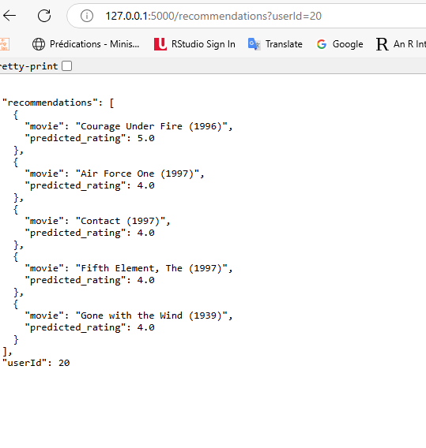

 Ces résultats montrent que **l’API Flask** répond correctement aux requêtes **HTTP** et renvoie des **recommandations personnalisées** au format **JSON**.  

- ✅ **La requête avec `userId=20`** a abouti à un **code `200`** et a retourné **un ensemble de films recommandés**, chacun accompagné de sa **note prédite**.
- ✅ **Sur le navigateur**, l’affichage confirme la **bonne intégration de l’API**, fournissant une **réponse structurée et lisible** pour l’utilisateur.

# 3️⃣ 📖 Guide d'Utilisation du Système de Recommandation de Films

## 📌 Introduction
Ce système de recommandation de films vous permet d'obtenir des **suggestions personnalisées** basées sur vos préférences.  

Vous disposez de **deux outils principaux** :
- 🖥 **Un script interactif (`recommandations_interactives.py`)** permettant d’obtenir des recommandations via la ligne de commande.
- 🌍 **Une API RESTful (`api_recommendations.py`)** permettant d'intégrer le service dans une **application web ou mobile**.

---

## ⚙️ Prérequis
Avant d'utiliser ce système, assurez-vous d’avoir **l’environnement et les fichiers nécessaires** :

✔️ **Environnement** : Python **3.7 ou supérieur**.  
✔️ **Dépendances** : Installez les packages suivants avec `pip` :  
   ```bash
   pip install flask pandas numpy scikit-learn

✔️ Données : Placez les fichiers movies.csv et ratings.csv (ou merged_final_data.csv) dans le dossier :

C:\projet_work\Data-source\
✔️ Scripts : Les scripts doivent être situés dans le dossier :

C:\projet_work\Script\

🖥️ Utilisation du Script Interactif
1️⃣ Accès au script
Ouvrez une invite de commande et naviguez vers le dossier des scripts :

cd C:\projet_work\Script
2️⃣ Exécution du script
Lancez le script interactif avec :
python recommandations_interactives.py
3️⃣ Procédure interactive
Le script vous demandera d’entrer votre identifiant utilisateur (userId).
Après saisie d’un userId valide, le système affichera une liste de films recommandés accompagnée de la note prédite pour chacun.
🌍 Utilisation de l'API Flask
1️⃣ Lancement de l’API
Dans l’invite de commande, naviguez vers le dossier des scripts et exécutez :
cd C:\projet_work\Script
python api_recommendations.py
L'API démarrera sur :
http://127.0.0.1:5000
2️⃣ Accès aux recommandations
Vous pouvez utiliser :
Un navigateur 🖥️
Un outil comme Postman 🛠️
Une requête HTTP (curl, requests en Python, etc.)
L’endpoint à appeler est :
http://127.0.0.1:5000/recommendations?userId=<votre_userId>
Remplacez <votre_userId> par votre identifiant numérique.
3️⃣ Réponse attendue (format JSON)
L’API retourne une réponse contenant les films recommandés et leurs notes prédites, par exemple :
{
    "userId": 20,
    "recommendations": [
        {"movie": "Groundhog Day (1993)", "predicted_rating": 5.0},
        {"movie": "Mr. Holland's Opus (1995)", "predicted_rating": 5.0},
        {"movie": "Pulp Fiction (1994)", "predicted_rating": 4.60},
        {"movie": "12 Angry Men (1957)", "predicted_rating": 4.50},
        {"movie": "Fargo (1996)", "predicted_rating": 4.50}
    ]
}
❓ Support et Assistance
Pour toute question ou problème rencontré, veuillez consulter la documentation technique ou contacter l’équipe de support à l’adresse suivante :
📧 joye@support.badou

## 🎬 Conclusion

En conclusion, ce projet a démontré que la **mise en place d’un système de recommandation de films** est non seulement **faisable**, mais également **efficace** lorsqu’on exploite un jeu de données **soigneusement préparé et analysé**.  

Dès la phase initiale :
- ✅ **Collecte et centralisation des données** du dataset **MovieLens 100K**.
- ✅ **Fiabilisation et normalisation rigoureuses**, garantissant une base solide pour l’analyse.
- ✅ **Analyse exploratoire**, permettant de comprendre les comportements des utilisateurs et d’identifier les tendances globales.

### 📌 Hypothèses confirmées :
✔️ **Les utilisateurs ayant des notations similaires partagent des goûts proches.**  
✔️ **Les genres sont un indicateur fiable pour évaluer la similarité entre films.**  
✔️ **Les tendances globales des notations guident efficacement les recommandations.**  

---

### 🚀 Développement et choix du modèle
Sur la base de ces constats, plusieurs **modèles de recommandation** ont été développés en utilisant **KNN** :
- **User-User KNN**
- **Item-Item KNN**
- **Content-Based KNN**
- **Hybrid Content-User KNN**
- **Hybrid Content-Item KNN**

📌 **Après tests et optimisation des hyperparamètres** :
✅ **Le modèle Item-Item KNN** s’est révélé **le plus performant**, offrant **le meilleur RMSE**.  
✅ **Son approche exploite efficacement les similarités entre films** pour prédire les préférences des utilisateurs.  

---

### 🖥️ Accessibilité et Déploiement  
Le projet a été rendu **accessible en temps réel** grâce à :
- 📌 **Un script interactif Python** (`recommandations_interactives.py`).
- 📌 **Une API RESTful Flask**, permettant **une intégration facile dans d’autres applications**.

---

### 🔮 Perspectives et améliorations futures  
Ce travail démontre **l’efficacité du filtrage collaboratif**, mais ouvre aussi la voie à des **optimisations** :
- 🔹 **Explorer des modèles hybrides avancés** (ex: combinaisons pondérées, deep learning).
- 🔹 **Intégrer du Machine Learning supervisé** pour affiner les recommandations.
- 🔹 **Exploiter davantage les métadonnées des films** (ex: synopsis, acteurs, réalisateurs).

🎯 **Ce projet offre une solution complète et fonctionnelle** pour améliorer **l’expérience utilisateur** dans la découverte de films, tout en posant les bases pour des **améliorations futures**.

---

